# C++ 学习大纲（30 小节）

## 1. 学习目标与路线图（知识讲解）

### 1.1 C++ 的本质
C++ 是一门**静态类型**、**编译型**、**多范式**语言。它既能贴近硬件写高性能代码，也能通过类和模板构建高层抽象。

- 静态类型：类型在编译期确定，很多错误可提前发现。
- 编译型：先生成机器码再运行，通常性能更高。
- 多范式：过程式、面向对象、泛型可以组合使用。

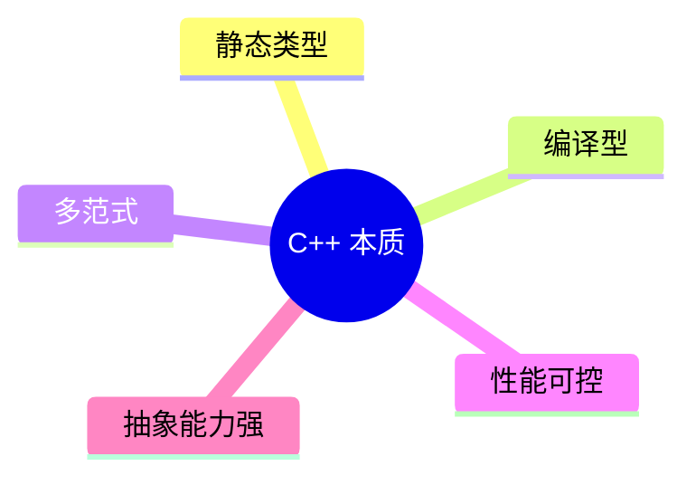

### 1.2 C++ 主要应用场景
- 高性能后端模块（低延迟、高吞吐）
- 游戏引擎与图形渲染
- 系统软件（数据库核心、编译器、中间件）
- 嵌入式与设备软件

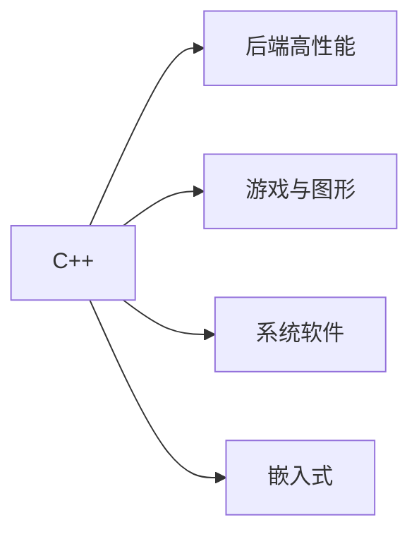

### 1.3 你真正要学的三层知识

#### 语法层
变量、函数、类、模板、STL、异常等“怎么写”。

#### 语义层
对象生命周期、所有权、拷贝与移动、RAII 等“为什么这样写”。

#### 工程层
编译链接、CMake、测试、调试、目录结构等“如何在项目里写”。

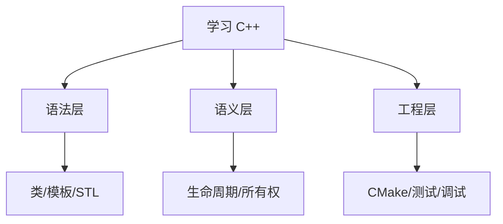

### 1.4 C++ 标准版本认知（学习基线）
现代学习建议以 **C++17/20** 为主：
- C++11：现代 C++ 起点（`auto`、Lambda、智能指针）
- C++17：工程常用增强（结构化绑定等）
- C++20：更强表达能力（`concepts`、`ranges`）

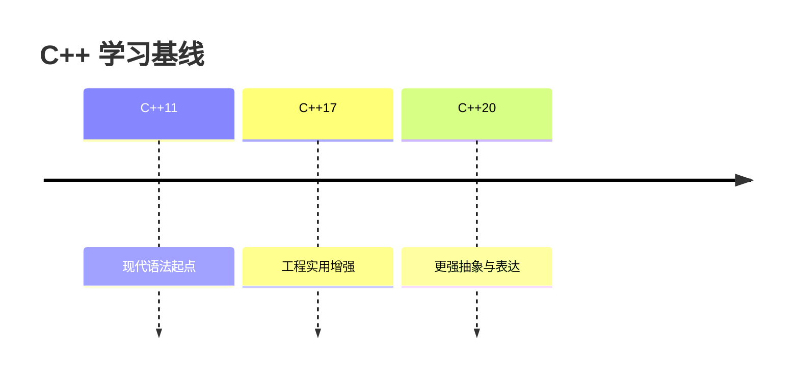

### 1.5 从源码到可执行文件：程序如何运行
典型流程：
1. 预处理（展开 `#include`、宏）
2. 编译（将 `.cpp` 转换为目标文件）
3. 链接（合并目标文件与库，生成可执行文件）

示例：
```bash
g++ -std=c++20 -Wall -Wextra main.cpp -o app
```


### 1.6 核心难点：对象生命周期与 RAII
C++ 的难点主要在“资源管理语义”。对象进入作用域时构造，离开作用域时析构。

```cpp
#include <iostream>

struct A {
    A() { std::cout << "construct\n"; }
    ~A() { std::cout << "destruct\n"; }
};

int main() {
    A a; // 进入作用域时构造
}      // 离开作用域时析构
```

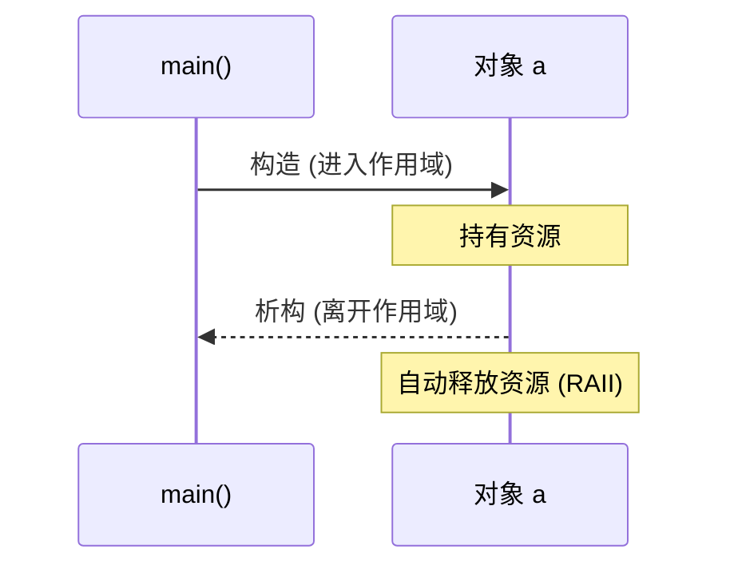

### 1.7 第一小节知识总结
- C++ 的核心价值是“性能 + 抽象 + 可控资源”。
- 学习不能只看语法，必须同时理解生命周期与工程化。
- C++17/20 是当前主学习基线。
- 编译链接流程与 RAII 是后续章节的基础。

## 2. 开发环境与工具链（知识讲解）

### 2.1 工具链由哪些部分组成
C++ 开发不是只装一个编译器，而是一套协同工具：
- 编译器：`g++` 或 `clang++`，负责把源码编译为目标文件。
- 构建系统：`CMake`，负责组织多文件工程与生成构建脚本。
- 调试器：`gdb`/`lldb`，用于断点、单步、变量检查。
- 编辑器/IDE：VS Code（配合 C/C++ 扩展）提升开发效率。

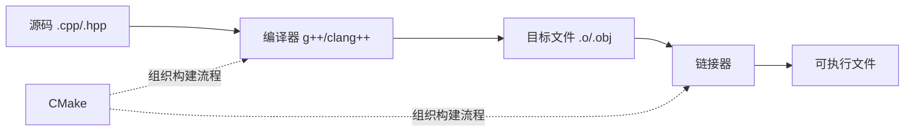

### 2.2 编译器的角色
编译器完成语法/语义检查并生成机器码。你需要理解两个常见差异：
- 标准支持差异：同一特性在不同编译器版本上的支持进度不同。
- 诊断风格差异：报错信息格式和严格程度不同。

常用编译选项：
- `-std=c++20`：指定语言标准。
- `-Wall -Wextra`：开启常用警告。
- `-Werror`：把警告当错误，提升代码质量。

### 2.3 构建系统（CMake）的作用
当项目从单文件变成多目录、多目标时，手写编译命令会变得难维护。CMake 用来声明：
- 哪些源文件参与构建
- 生成哪些目标（可执行文件/库）
- 目标间依赖关系

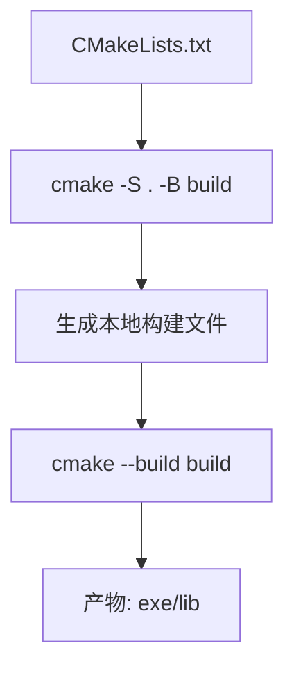

### 2.4 调试器如何帮助你定位问题
调试器的本质是“观察程序状态”：
- 断点：在特定行暂停。
- 单步：按执行路径逐行运行。
- 观察变量：查看当前作用域的数据值。
- 调用栈：定位函数调用链和崩溃位置。

没有调试器时，错误定位依赖猜测；有调试器时，定位基于证据。

### 2.5 编辑器与扩展
VS Code 在 C++ 开发里常承担“轻量 IDE”角色：
- IntelliSense：补全、跳转定义、符号搜索。
- Task/Launch：一键编译与调试。
- 与 CMake 插件协作：选择编译器、切换构建类型。

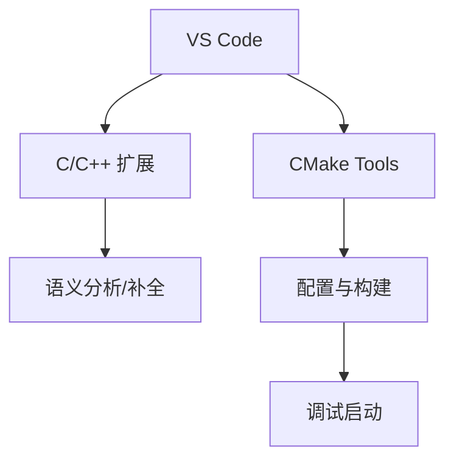

### 2.6 Debug 与 Release 的区别
- Debug：保留调试信息、优化较少，便于排错。
- Release：开启优化，运行更快，但调试信息较少。

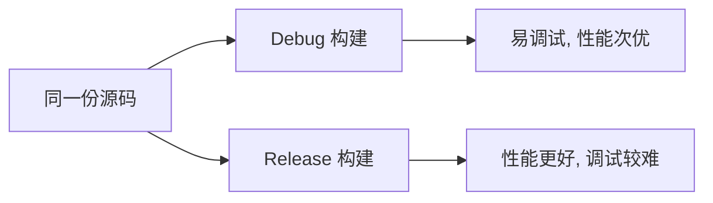

### 2.7 第 2 小节知识总结
- 工具链是“编译器 + 构建系统 + 调试器 + 编辑器”的协作体系。
- CMake 解决多文件工程可维护性问题。
- 调试器是定位问题的核心工具，不是可选项。
- Debug/Release 面向不同阶段：开发期与发布期。

## 3. 第一个 C++ 程序（知识讲解）

### 3.1 最小程序结构
一个最小 C++ 程序通常包含头文件、`main` 函数和返回值：

```cpp
#include <iostream>

int main() {
    std::cout << "Hello, C++!\n";
    return 0;
}
```

关键点：
- `#include <iostream>` 引入标准输入输出库。
- `int main()` 是程序入口。
- 返回 `0` 代表正常结束。

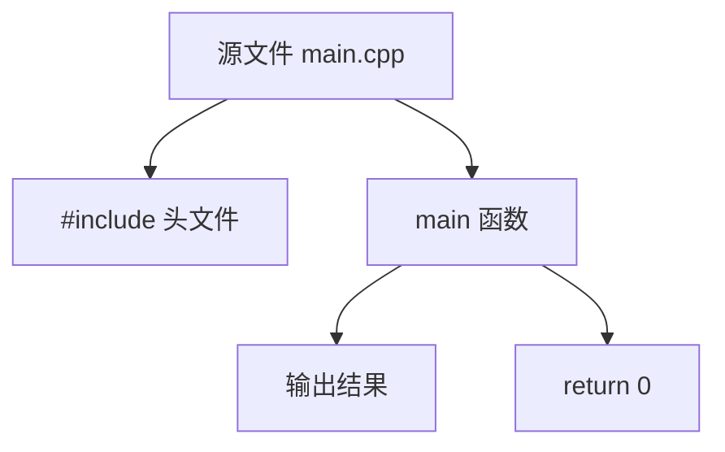

### 3.2 程序从“写完”到“可运行”发生了什么
C++ 不是直接执行源码，而是经过构建流程：
1. 预处理：展开头文件与宏。
2. 编译：将源码翻译为目标文件。
3. 链接：把目标文件和标准库合并成可执行文件。
4. 运行：操作系统加载并执行可执行文件。


### 3.3 第一条常用编译命令

```bash
g++ -std=c++20 -Wall -Wextra main.cpp -o app
```

参数含义：
- `-std=c++20`：使用 C++20 标准。
- `-Wall -Wextra`：开启常见警告。
- `-o app`：指定输出可执行文件名。

Windows PowerShell 运行：

```powershell
.\app.exe
```

### 3.4 `main` 函数与参数
`main` 常见两种形式：

```cpp
int main();
int main(int argc, char* argv[]);
```

- `argc`：命令行参数数量。
- `argv`：参数字符串数组。

这为后续命令行工具开发打基础。

### 3.5 输出与换行细节
- `"\n"`：换行字符，通常性能更好。
- `std::endl`：换行并强制刷新缓冲区。

在高频输出场景中，优先 `"\n"`，仅在确实需要立即刷新时用 `std::endl`。

### 3.6 常见错误类型（理解即可）
- 编译错误：语法错误、类型不匹配。
- 链接错误：声明了函数但没有定义实现。
- 运行错误：越界、空指针、未定义行为。

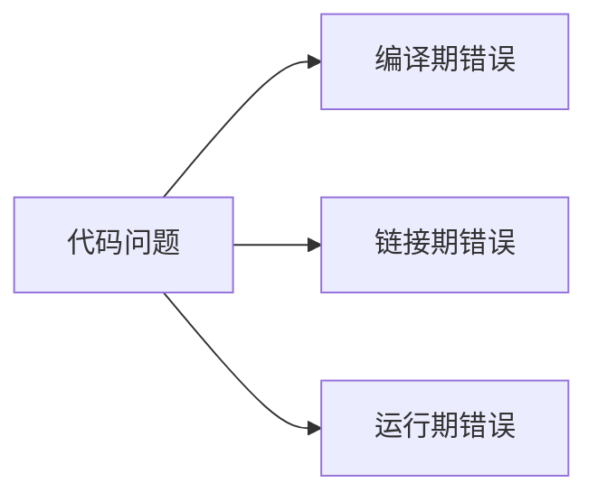

### 3.7 第 3 小节知识总结
- `main` 是程序入口，C++ 程序必须经过编译和链接。
- 单文件程序可以用一条编译命令快速构建。
- 区分编译错误、链接错误、运行错误是后续排错基础。
- 理解参数版 `main` 有助于后续命令行项目开发。

## 4. 变量、常量与基本类型（知识讲解）

### 4.1 变量与常量的本质
- 变量：可变的数据存储单元。
- 常量：初始化后不可修改的数据。

```cpp
int age = 20;           // 变量
const int maxUsers = 8; // 常量
```

C++ 中“命名 + 类型 + 生命周期”共同决定一个对象如何被使用。

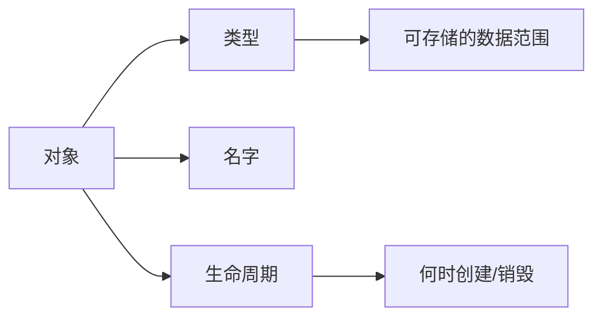

### 4.2 基本类型体系
常见基本类型：
- 整数：`short`、`int`、`long long`
- 无符号整数：`unsigned int` 等
- 浮点：`float`、`double`
- 字符：`char`
- 布尔：`bool`

注意：不同平台位宽可能不同，工程中常用 `<cstdint>` 的定宽类型（如 `int32_t`、`uint64_t`）。

### 4.3 有符号与无符号
- 有符号类型可表示负数。
- 无符号类型只能表示非负值，范围更大。

混用时要警惕隐式转换：

```cpp
int a = -1;
unsigned int b = 1;
// 比较时可能发生类型提升，结果未必符合直觉
```

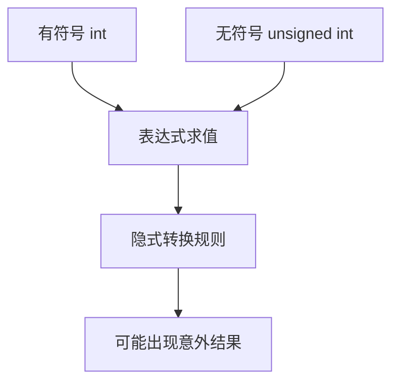

### 4.4 初始化方式
C++ 常见初始化：
- 拷贝初始化：`int x = 1;`
- 直接初始化：`int x(1);`
- 列表初始化：`int x{1};`（推荐，能避免部分窄化转换）

```cpp
int x{3};      // 推荐
// int y{3.14}; // 窄化，编译期报错
```

### 4.5 `auto` 与类型推导
`auto` 让编译器推导类型，减少冗长声明，但要确保可读性。

```cpp
auto count = 10;      // int
auto price = 9.99;    // double
auto ok = true;       // bool
```

原则：当右值类型明确时优先 `auto`，当类型语义需要强调时写显式类型。

### 4.6 作用域与生命周期
- 局部变量：在代码块内有效，离开块后销毁。
- 全局变量：程序启动到结束期间存在。
- 静态局部变量：函数内定义，但生命周期贯穿程序全程。

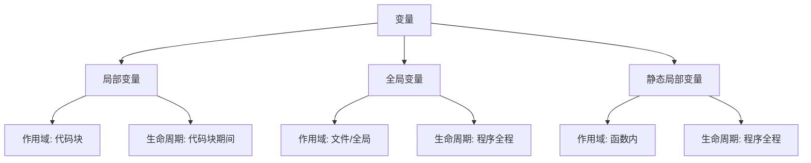

### 4.7 类型转换
- 隐式转换：编译器自动完成。
- 显式转换：程序员主动指定（优先 `static_cast`）。

```cpp
double score = 95.5;
int whole = static_cast<int>(score); // 95
```

避免 C 风格强转 `(int)score`，可读性和安全性较差。

### 4.8 第 4 小节知识总结
- 类型决定数据范围和运算语义。
- 初始化方式会影响安全性，推荐使用 `{}` 初始化。
- `auto` 提升简洁度，但要兼顾可读性。
- 作用域与生命周期是后续内存管理与对象语义的基础。
- 类型转换要显式、可控，减少隐式转换带来的错误。

## 5. 运算符与表达式（知识讲解）

### 5.1 什么是表达式
表达式是“计算并产生结果”的代码片段，运算符用于组合操作数形成表达式。

```cpp
int a = 3;
int b = 5;
int c = a + b * 2; // 一个表达式
```


### 5.2 运算符分类
- 算术运算符：`+ - * / %`
- 关系运算符：`== != < <= > >=`
- 逻辑运算符：`&& || !`
- 赋值运算符：`= += -= *= /= %=`
- 自增自减：`++ --`
- 条件运算符：`?:`
- 位运算符：`& | ^ ~ << >>`

### 5.3 优先级与结合性
同一表达式里，运算符按优先级计算；同级运算符按结合性决定方向。

```cpp
int x = 2 + 3 * 4;   // 14，先乘后加
int y = (2 + 3) * 4; // 20，用括号改变顺序
```

原则：不要依赖“记忆极限”，复杂表达式优先加括号增强可读性。

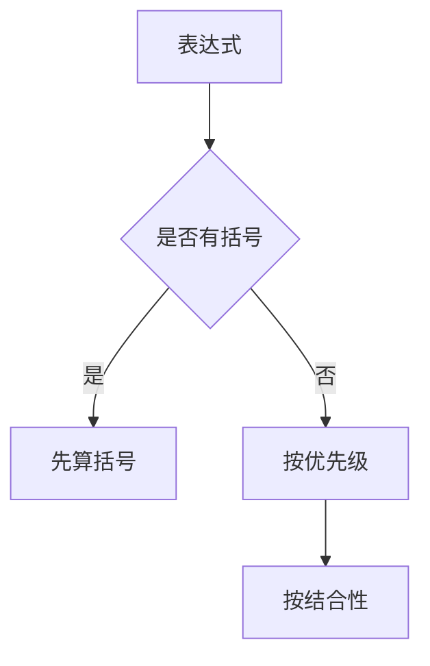

### 5.4 前置与后置自增
- `++i`：先加 1，再返回新值。
- `i++`：先返回旧值，再加 1。

```cpp
int i = 1;
int a = ++i; // i=2, a=2
int b = i++; // b=2, i=3
```

在不需要旧值时，优先前置形式，语义更直接。

### 5.5 短路求值（逻辑运算关键）
- `A && B`：若 `A` 为假，`B` 不再计算。
- `A || B`：若 `A` 为真，`B` 不再计算。

```cpp
int* p = nullptr;
if (p != nullptr && *p > 0) {
    // 安全：当 p 为 nullptr 时不会解引用
}
```

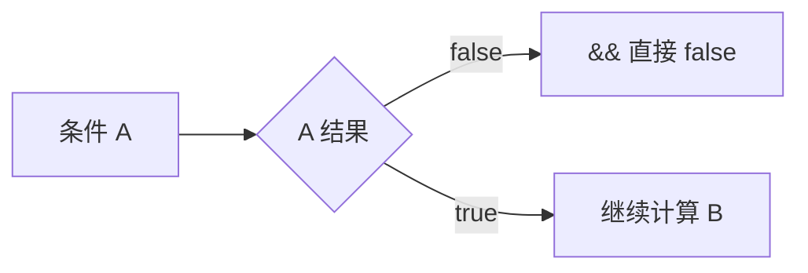

### 5.6 隐式类型提升
混合类型运算会发生“整型提升/通常算术转换”。

```cpp
int a = 5;
double b = 2.0;
a + b; // 结果类型为 double
```

风险点：有符号与无符号混算、整除截断。

```cpp
int m = 5 / 2;      // 2（整数除法）
double n = 5 / 2.0; // 2.5
```

### 5.7 位运算基础认知
位运算直接操作二进制位，常用于权限位、状态位、性能敏感场景。

```cpp
unsigned int flag = 0b0101;
flag |= 0b0010; // 置位 -> 0111
flag &= ~0b0001; // 清位 -> 0110
```

### 5.8 常见错误模式
- 把 `=` 写成 `==`（或反过来）。
- 整数除法误当浮点除法。
- 复杂表达式无括号导致误读。
- 忽视短路求值和副作用顺序。

### 5.9 第 5 小节知识总结
- 表达式是值计算的核心，运算符决定计算规则。
- 优先级和结合性影响结果，括号是可读性与安全性的工具。
- 短路求值可避免无效或危险计算。
- 类型提升和整数除法是初学阶段高频错误点。

## 6. 输入输出与文件基础（知识讲解）

### 6.1 标准输入输出流
C++ 使用流（stream）模型进行 I/O：
- `std::cin`：标准输入（键盘）
- `std::cout`：标准输出（控制台）
- `std::cerr`：标准错误输出（通常不缓冲）

```cpp
#include <iostream>

int main() {
    int x{};
    std::cout << "请输入整数: ";
    std::cin >> x;
    std::cout << "你输入的是 " << x << "\n";
}
```


### 6.2 提取运算符与插入运算符
- `>>`：从流中提取数据到变量。
- `<<`：把数据插入到输出流。

注意：`cin >> str` 默认以空白字符分隔，读取一行文本应使用 `std::getline`。

### 6.3 `std::getline` 与缓冲区问题
`std::getline` 读取整行（可包含空格）：

```cpp
#include <iostream>
#include <string>

int main() {
    int age{};
    std::string name;

    std::cin >> age;
    std::cin.ignore();        // 忽略残留换行
    std::getline(std::cin, name);
}
```

当 `>>` 后紧接 `getline`，常见问题是前者留下的换行符被后者直接读取。

### 6.4 流状态与错误处理
输入失败时，流会进入失败状态，后续读取会持续失败，直到清除状态。

```cpp
if (!(std::cin >> value)) {
    std::cin.clear();
    std::cin.ignore(1024, '\n');
}
```

```mermaid
flowchart TD
  A[尝试读取] --> B{读取成功?}
  B -- 是 --> C[继续处理]
  B -- 否 --> D[fail 状态]
  D --> E[clear()]
  E --> F[ignore()]
  F --> A
```

### 6.5 输出格式化基础
常见格式化工具来自 `<iomanip>`：
- `std::fixed`：定点表示
- `std::setprecision(n)`：小数位控制
- `std::setw(n)`：字段宽度

```cpp
#include <iomanip>
std::cout << std::fixed << std::setprecision(2) << 3.14159 << "\n"; // 3.14
```

### 6.6 文件输入输出
文件流类型：
- `std::ifstream`：读文件
- `std::ofstream`：写文件
- `std::fstream`：读写文件

```cpp
#include <fstream>
#include <string>

std::ofstream out("data.txt");
out << "hello\n";
out.close();

std::ifstream in("data.txt");
std::string line;
while (std::getline(in, line)) {
    // 处理 line
}
```

```mermaid
flowchart LR
  A[程序] --> B[open 文件]
  B --> C{打开成功?}
  C -- 否 --> D[错误处理]
  C -- 是 --> E[读/写循环]
  E --> F[close]
```

### 6.7 文本模式与二进制模式
默认是文本模式。处理图片、音频等原始字节数据时应使用二进制模式：

```cpp
std::ifstream in("a.bin", std::ios::binary);
```

### 6.8 常见错误模式
- 未检查文件是否打开成功。
- 混用 `>>` 与 `getline` 忽略缓冲区换行。
- 输入失败后未 `clear + ignore`。
- 直接信任用户输入，缺少边界校验。

### 6.9 第 6 小节知识总结
- C++ I/O 基于流对象，核心是流状态管理。
- `>>` 与 `getline` 适用于不同读取场景。
- 文件读写必须做“打开检查 + 错误处理”。
- 正确处理输入失败和缓冲区问题是写稳健程序的基础。

## 7. 分支与循环控制（知识讲解）

### 7.1 控制流的意义
控制流用于决定“哪些语句执行、执行几次、何时结束”。
核心结构分为两类：
- 分支：根据条件选择路径。
- 循环：重复执行一段逻辑直到条件变化。

```mermaid
graph TD
  A[程序执行] --> B[分支]
  A --> C[循环]
  B --> D[if / switch]
  C --> E[for / while / do-while]
```

### 7.2 `if / else if / else`
`if` 适合处理范围判断、布尔条件组合。

```cpp
int score = 82;
if (score >= 90) {
    std::cout << "A\n";
} else if (score >= 80) {
    std::cout << "B\n";
} else {
    std::cout << "C\n";
}
```

条件表达式最终会转换为布尔值，建议写出显式比较，减少歧义。

### 7.3 `switch` 结构
`switch` 适合离散值分派（如状态码、菜单命令）。

```cpp
int cmd = 2;
switch (cmd) {
case 1:
    std::cout << "start\n";
    break;
case 2:
    std::cout << "stop\n";
    break;
default:
    std::cout << "unknown\n";
    break;
}
```

重点：`case` 末尾通常要 `break`，否则会发生贯穿（fallthrough）。

```mermaid
flowchart TD
  A[switch(expr)] --> B{case 1?}
  B -- 是 --> C[执行 case 1]
  B -- 否 --> D{case 2?}
  D -- 是 --> E[执行 case 2]
  D -- 否 --> F[default]
```

### 7.4 `for` 循环
`for` 适合“已知迭代次数”或“按索引访问”。

```cpp
for (int i = 0; i < 5; ++i) {
    std::cout << i << " ";
}
```

结构：初始化 -> 条件判断 -> 执行体 -> 迭代表达式。

### 7.5 `while` 与 `do-while`
- `while`：先判断再执行，可能一次都不执行。
- `do-while`：先执行再判断，至少执行一次。

```cpp
int n = 0;
while (n < 3) {
    ++n;
}

do {
    --n;
} while (n > 0);
```

### 7.6 循环控制语句
- `break`：立即退出当前循环。
- `continue`：跳过本次剩余语句，进入下一次迭代。

```cpp
for (int i = 0; i < 10; ++i) {
    if (i == 5) break;
    if (i % 2 == 0) continue;
    std::cout << i << " "; // 输出 1 3
}
```

```mermaid
flowchart LR
  A[进入循环体] --> B{条件1 break?}
  B -- 是 --> C[退出循环]
  B -- 否 --> D{条件2 continue?}
  D -- 是 --> E[下一次迭代]
  D -- 否 --> F[执行剩余逻辑]
```

### 7.7 常见错误模式
- `if (x = 3)` 写成赋值而非比较（应为 `==`）。
- `switch` 忘记 `break` 导致意外贯穿。
- 循环条件不更新造成死循环。
- 边界条件错误导致越界（如 `i <= size`）。

### 7.8 可读性与工程建议
- 分支条件复杂时拆成布尔变量，提升可读性。
- 避免超过 3 层嵌套；必要时提取函数。
- 循环优先前置自增 `++i`（语义更统一）。
- 明确处理边界值：空输入、0 次循环、单元素场景。

### 7.9 第 7 小节知识总结
- 分支决定“走哪条路”，循环决定“走几次”。
- `if` 适合范围判断，`switch` 适合离散分派。
- `break/continue` 是控制循环行为的核心工具。
- 控制流错误多来自边界和条件写法，需重点检查。

## 8. 函数基础（知识讲解）

### 8.1 为什么需要函数
函数用于把重复逻辑封装为可复用单元，提升可读性、可测试性与维护性。

```mermaid
graph TD
  A[需求逻辑] --> B[拆分为函数]
  B --> C[复用]
  B --> D[易测试]
  B --> E[易维护]
```

### 8.2 函数声明与定义
- 声明（declaration）：告诉编译器“函数存在”。
- 定义（definition）：提供函数具体实现。

```cpp
#include <iostream>

int add(int a, int b); // 声明

int main() {
    std::cout << add(2, 3) << "\n";
}

int add(int a, int b) { // 定义
    return a + b;
}
```

多文件工程中，声明通常放头文件，定义放 `.cpp`。

### 8.3 参数与返回值
函数通过参数接收输入，通过 `return` 返回结果。

```cpp
double area(double r) {
    return 3.14159 * r * r;
}
```

设计原则：参数表达输入边界，返回值表达核心结果。

### 8.4 值传递与引用传递
- 值传递：传入副本，函数内修改不影响外部。
- 引用传递：传入别名，函数内修改会影响外部对象。

```cpp
void incByValue(int x) { ++x; }
void incByRef(int& x) { ++x; }
```

```mermaid
flowchart LR
  A[实参 x] --> B{传参方式}
  B -- 值传递 --> C[拷贝副本]
  C --> D[外部 x 不变]
  B -- 引用传递 --> E[同一对象别名]
  E --> F[外部 x 改变]
```

### 8.5 `const` 参数
只读参数应使用 `const`，明确语义并防止误修改。

```cpp
int length(const std::string& s) {
    return static_cast<int>(s.size());
}
```

对大对象，常见写法是 `const T&`，避免拷贝开销。

### 8.6 默认参数
默认参数在调用时可省略部分实参。

```cpp
void log(const std::string& msg, int level = 1);
```

规则：默认值从右向左连续提供，声明与定义中只保留一处默认值（通常在声明处）。

### 8.7 函数重载
同名函数可通过不同参数列表区分。

```cpp
int absValue(int x) { return x < 0 ? -x : x; }
double absValue(double x) { return x < 0 ? -x : x; }
```

重载解析在编译期完成，返回类型不同但参数相同不构成有效重载。

### 8.8 内联函数与头文件实现
`inline` 建议编译器内联展开，减少调用开销（是否展开由编译器决定）。

```cpp
inline int square(int x) { return x * x; }
```

小而频繁调用的函数可考虑内联，大函数不建议强行内联。

### 8.9 递归基础
函数可以调用自身，需具备“终止条件 + 递归推进”。

```cpp
int fact(int n) {
    if (n <= 1) return 1;
    return n * fact(n - 1);
}
```

递归表达清晰，但要关注栈深度与性能。

### 8.10 常见错误模式
- 只声明不定义，导致链接错误。
- 头文件重复定义普通函数，导致重定义错误。
- 不必要的大对象值传递造成性能浪费。
- 递归缺失终止条件导致栈溢出。

### 8.11 第 8 小节知识总结
- 函数是 C++ 代码组织的基础单元。
- 理解声明/定义分离是工程化前提。
- 参数传递方式决定语义与性能。
- `const`、重载、默认参数提升接口表达力。
- 递归与内联需按场景权衡可读性和效率。

## 9. 引用与 `const` 语义（知识讲解）

### 9.1 引用的本质
引用（`T&`）是已存在对象的别名，不是独立对象。

```cpp
int x = 10;
int& ref = x; // ref 是 x 的别名
ref = 20;     // x 也变成 20
```

关键性质：
- 引用必须初始化。
- 普通引用不能绑定到字面量等右值。
- 引用一旦绑定，不可改绑到别的对象。

```mermaid
graph LR
  A[x: int] <--别名--> B[ref: int&]
  B --> C[写入 ref]
  C --> D[x 同步变化]
```

### 9.2 为什么引用重要
引用是函数参数设计核心：
- 通过引用避免大对象拷贝。
- 通过引用实现“在函数内修改外部对象”。
- 与 `const` 结合表达只读语义。

### 9.3 `const` 的核心语义
`const` 表示“只读约束”。它约束的是“通过该名字是否可修改对象”。

```cpp
const int a = 5;
// a = 6; // 错误：只读
```

重要理解：`const` 是接口承诺，告诉调用方“此处不会改动你的数据”。

### 9.4 `const` 引用
`const T&` 是高频接口形式：
- 避免拷贝
- 保证只读
- 可绑定左值和右值（包括临时对象）

```cpp
void printValue(const std::string& s) {
    std::cout << s << "\n";
}

printValue("hello"); // 字面量构造临时 string 后可绑定 const 引用
```

```mermaid
flowchart TD
  A[实参] --> B{参数类型}
  B -- T& --> C[可改, 仅左值]
  B -- const T& --> D[只读, 左值/右值均可]
```

### 9.5 顶层 const 与底层 const
- 顶层 const：对象本身不可改（如 `const int x`）。
- 底层 const：通过某个间接访问路径不可改（如 `const int* p`）。

这一区分在模板推导、`auto` 推导、指针声明中非常关键。

### 9.6 `const` 与指针组合（重点）

```cpp
int v = 10;
const int* p1 = &v; // 指向常量的指针：*p1 不可改，p1 可改指向
int* const p2 = &v; // 常量指针：p2 不可改指向，*p2 可改
const int* const p3 = &v; // 两者都不可改
```

```mermaid
graph TD
  A[const int* p1] --> A1[改指向: 可以]
  A --> A2[改值: 不可以]
  B[int* const p2] --> B1[改指向: 不可以]
  B --> B2[改值: 可以]
  C[const int* const p3] --> C1[改指向: 不可以]
  C --> C2[改值: 不可以]
```

### 9.7 `auto` 推导与 const 丢失问题
`auto` 默认会忽略顶层 `const`：

```cpp
const int x = 42;
auto a = x;       // a 是 int（顶层 const 被丢弃）
const auto b = x; // b 是 const int
```

若需要保持引用与只读属性，应写：

```cpp
const int& r = x;
auto c = r;        // c 是 int
const auto& d = r; // d 是 const int&
```

### 9.8 常见错误模式
- 把“只读参数”写成值传递，导致多余拷贝。
- 误把 `const int*` 理解为“指针常量”。
- 使用 `auto` 时丢失 `const`/引用语义。
- 为追求“能改”滥用 `const_cast`（高风险）。

### 9.9 第 9 小节知识总结
- 引用是别名机制，是函数接口设计核心。
- `const` 是只读承诺与设计约束，不是装饰语法。
- `const T&` 是高频且高性价比的参数形式。
- 指针与 `const` 组合必须精确理解“谁可改、谁不可改”。
- 掌握 `auto` 对 `const` 的推导规则，能避免大量隐性 bug。

## 10. 指针基础（知识讲解）

### 10.1 指针是什么
指针是“存放内存地址的变量”。它让你可以间接访问对象。

```cpp
int x = 10;
int* p = &x;   // p 存储 x 的地址
std::cout << *p << "\n"; // 解引用，读取 x 的值
```

```mermaid
graph LR
  A[p: 指针变量] --> B[地址: &x]
  B --> C[x: int = 10]
  A --> D[*p 访问 x]
```

### 10.2 `&` 与 `*` 的含义
- `&x`：取地址，得到对象在内存中的位置。
- `*p`：解引用，通过地址访问对象。

指针声明中的 `*` 表示“p 是指针类型”；表达式中的 `*p` 表示“访问 p 指向的对象”。

### 10.3 空指针与安全检查
空指针表示“不指向任何有效对象”。现代 C++ 使用 `nullptr`。

```cpp
int* p = nullptr;
if (p != nullptr) {
    std::cout << *p << "\n";
}
```

解引用空指针是未定义行为，可能直接崩溃。

### 10.4 指针与数组
数组名在多数表达式中会退化为首元素地址。

```cpp
int arr[3] = {10, 20, 30};
int* p = arr;      // 等价于 &arr[0]
std::cout << p[1]; // 20
```

```mermaid
flowchart LR
  A[arr[0]] --> B[arr[1]] --> C[arr[2]]
  P[p = &arr[0]] --> A
```

### 10.5 指针算术
对指针加减整数会按“元素大小”移动，不是按字节随意移动。

```cpp
int arr[3] = {10, 20, 30};
int* p = arr;
++p;          // 指向 arr[1]
std::cout << *p; // 20
```

指针算术只在同一数组范围内有意义，越界行为未定义。

### 10.6 `const` 与指针回顾
- `const int* p`：不能通过 `p` 改值。
- `int* const p`：`p` 本身不能改指向。
- `const int* const p`：两者都不能改。

```mermaid
graph TD
  A[const int* p] --> A1[改指向: 可以]
  A --> A2[改值: 不可以]
  B[int* const p] --> B1[改指向: 不可以]
  B --> B2[改值: 可以]
  C[const int* const p] --> C1[改指向: 不可以]
  C --> C2[改值: 不可以]
```

例子：

```c++
 #include <iostream>
  using namespace std;

  int main() {
      int x = 10;
      int y = 20;

      // 1) const int* p：指向常量的指针（p 可改指向，*p 不可改）
      const int* p1 = &x;
      // *p1 = 11;          // ❌ 编译错误：不能通过 p1 修改值
      p1 = &y;              // ✅ 可以改指向
      cout << "*p1 = " << *p1 << "\n";  // 20

      // 2) int* const p：常量指针（p 不可改指向，*p 可改）
      int* const p2 = &x;
      *p2 = 99;             // ✅ 可以改值
      // p2 = &y;           // ❌ 编译错误：p2 不能改指向
      cout << "x = " << x << "\n";      // 99

      // 3) const int* const p：常量指针 + 指向常量（都不可改）
      const int* const p3 = &x;
      // *p3 = 100;         // ❌ 编译错误：不能改值
      // p3 = &y;           // ❌ 编译错误：不能改指向
      cout << "*p3 = " << *p3 << "\n";  // 99
  }

```


### 10.7 指针作为函数参数

指针参数常用于“可选输入”或“需要可为空”的场景。

```cpp
void printIfNotNull(const int* p) {
    if (p) std::cout << *p << "\n";
}
```

和引用相比，指针更灵活（可为空），但调用方与被调方都要做空值安全处理。

### 10.8 常见错误模式
- 野指针：未初始化就使用。
- 悬空指针：指向已释放或已失效对象。
- 空指针解引用：`*nullptr`。
- 越界访问：指针算术超出合法范围。

### 10.9 第 10 小节知识总结
- 指针是“地址”的抽象，`&` 取地址、`*` 解引用。
- `nullptr` 是现代 C++ 空指针写法。
- 数组与指针关系紧密，但边界必须严格控制。
- 指针强大但风险高，后续会用 RAII 与智能指针降低错误率。

## 11. 数组与字符串（知识讲解）

### 11.1 数组的基本概念
数组是“同类型元素的连续内存块”，通过下标访问。

```cpp
int arr[5] = {1, 2, 3, 4, 5};
std::cout << arr[0] << " " << arr[4] << "\n";
```

```mermaid
graph LR
  A["arr[0]"] --> B["arr[1]"] --> C["arr[2]"] --> D["arr[3]"] --> E["arr[4]"]
```

重点：下标范围是 `[0, n-1]`，越界访问是未定义行为。

### 11.2 C 风格数组与 `std::array`
- C 风格数组：语法直接、性能高，但不记录长度信息。
- `std::array<T, N>`：固定长度容器，接口更现代、安全性更好。

```cpp
#include <array>

std::array<int, 3> a{10, 20, 30};
std::cout << a.size() << "\n"; // 3
```

工程中优先使用 `std::array`（固定长度）或 `std::vector`（动态长度）。

### 11.3 遍历方式
常见遍历方式：

```cpp
int arr[3] = {10, 20, 30};
for (int i = 0; i < 3; ++i) {
    std::cout << arr[i] << " ";
}

for (int v : arr) {
    std::cout << v << " ";
}
```

范围 `for` 在不需要索引时更简洁、可读性更高。

### 11.4 `std::string` 基础
`std::string` 是 C++ 标准字符串类型，自动管理内存。

```cpp
#include <string>

std::string s = "hello";
s += " world";
std::cout << s << "\n"; // hello world
```

常用操作：
- `size()/length()`：长度
- `substr(pos, len)`：子串
- `find()`：查找
- `+` 或 `+=`：拼接

### 11.5 C 字符串与 `std::string` 区别
- C 字符串：`char[]`，以 `\0` 结尾，需手动处理边界。
- `std::string`：封装长度和容量，接口更安全易用。

```cpp
char cstr[] = "abc";      // C 字符串
std::string str = "abc";  // C++ 字符串
```

```mermaid
flowchart TD
  A[字符串处理需求] --> B{选型}
  B -- 现代 C++ --> C[std::string]
  B -- 兼容旧接口 --> D["char* / char[]"]
```

### 11.6 字符串输入的常见坑
- `cin >> s`：读到空白就停止。
- `getline(cin, s)`：读取整行（含空格）。

```cpp
std::string line;
std::getline(std::cin, line);
```

若前面使用过 `>>`，应先处理残留换行（如 `cin.ignore()`）。

### 11.7 字符串与数字转换
常见转换函数：
- `std::stoi`：字符串转 `int`
- `std::stod`：字符串转 `double`
- `std::to_string`：数字转字符串

```cpp
int n = std::stoi("123");
std::string s = std::to_string(3.14);
```

### 11.8 常见错误模式
- 数组越界访问。
- 把 C 字符串当作可无限写入缓冲区。
- 混用 `>>` 与 `getline` 导致读取空行。
- 对空字符串直接访问 `s[0]`。

### 11.9 第 11 小节知识总结
- 数组是连续内存结构，边界控制是第一原则。
- 现代 C++ 字符串优先使用 `std::string`。
- 固定长度集合优先 `std::array`，更安全可读。
- 输入、转换和边界处理决定字符串代码稳定性。

## 12. 结构体与枚举（知识讲解）

### 12.1 为什么需要结构体和枚举
- `struct`：把相关字段聚合成一个自定义类型。
- `enum class`：为离散状态提供有类型约束的取值集合。

```mermaid
graph TD
  A[业务数据] --> B[struct 建模]
  A --> C[enum class 状态建模]
  B --> D[字段聚合]
  C --> E[类型安全]
```

### 12.2 `struct` 基础
`struct` 默认成员访问权限是 `public`，适合纯数据对象。

```cpp
#include <string>

struct Student {
    int id;
    std::string name;
    double score;
};

Student s{1, "Alice", 92.5};
```

与 `class` 的主要语法差别：默认访问权限（`struct` 是 `public`，`class` 是 `private`）。

### 12.3 成员函数与行为封装
`struct` 也可以有成员函数，不只是“数据袋子”。

```cpp
struct Point {
    double x;
    double y;

    double length2() const {
        return x * x + y * y;
    }
};
```

当数据和简单行为强相关时，放在同一个类型里更清晰。

### 12.4 初始化方式
推荐使用列表初始化，避免遗漏字段：

```cpp
struct Config {
    int port;
    bool debug;
};

Config c{8080, true};
```

也可使用默认成员初始值：

```cpp
struct Config2 {
    int port = 8080;
    bool debug = false;
};
```

### 12.5 枚举类型：`enum` vs `enum class`
传统 `enum` 存在命名污染和隐式转换问题，现代 C++ 优先 `enum class`。

```cpp
enum class Color {
    Red,
    Green,
    Blue
};

Color c = Color::Red;
```

```mermaid
flowchart LR
  A[enum] --> B[命名易冲突]
  A --> C[可隐式转 int]
  D[enum class] --> E[作用域隔离]
  D --> F[转换需显式]
```

### 12.6 枚举与 `switch`
`enum class` 常与 `switch` 配合处理状态机逻辑。

```cpp
enum class State { Idle, Running, Error };

void handle(State s) {
    switch (s) {
    case State::Idle:
        break;
    case State::Running:
        break;
    case State::Error:
        break;
    }
}
```

建议覆盖所有枚举分支，减少遗漏。

### 12.7 枚举底层类型
可显式指定底层类型，便于与协议/存储格式对齐。

```cpp
#include <cstdint>

enum class Status : std::uint8_t {
    Ok = 0,
    Fail = 1
};
```

### 12.8 常见错误模式
- 把 `struct` 当全局可写数据集合，导致耦合失控。
- 使用传统 `enum` 导致命名冲突。
- 忘记为 `enum class` 使用作用域限定（如 `Color::Red`）。
- `switch` 未覆盖全部状态，导致分支遗漏。

### 12.9 第 12 小节知识总结
- `struct` 用于聚合数据并组织相关行为。
- `enum class` 提供更强类型安全与命名隔离。
- 二者结合是建模“实体 + 状态”的基础方式。
- 这一节是后续类设计、状态机和模块接口的前置能力。

## 13. 类与对象入门（知识讲解）

### 13.1 为什么需要类
类（`class`）用于把“数据 + 行为”封装在一起，建立清晰边界。

```mermaid
graph TD
  A[业务对象] --> B[数据成员]
  A --> C[成员函数]
  B --> D[状态]
  C --> E[行为]
```

相比 `struct`，`class` 默认成员访问权限是 `private`，更强调封装。

### 13.2 类与对象的关系
- 类：类型蓝图。
- 对象：类的实例。

```cpp
class Counter {
private:
    int value;

public:
    Counter() : value(0) {}
    void increment() { ++value; }
    int get() const { return value; }
};

Counter c;
c.increment();
```

### 13.3 访问控制（封装核心）
- `private`：仅类内部可访问。
- `public`：类外可访问接口。
- `protected`：类和派生类可访问（继承章节详细展开）。

封装目标：隐藏实现细节，只暴露稳定接口。

```mermaid
flowchart LR
  A[类外部] --> B[public 接口]
  B --> C[private 数据]
  A -.不能直接访问.-> C
```

### 13.4 构造函数与析构函数
- 构造函数：对象创建时初始化资源。
- 析构函数：对象销毁时释放资源。

```cpp
class FileGuard {
public:
    FileGuard() {
        // 获取资源
    }

    ~FileGuard() {
        // 释放资源
    }
};
```

这是 RAII 在类设计中的直接体现。

### 13.5 成员初始化列表
初始化成员优先使用“初始化列表”，而不是构造函数体内赋值。

```cpp
class User {
private:
    int id;
    std::string name;

public:
    User(int i, std::string n) : id(i), name(std::move(n)) {}
};
```

场景上更必要于：`const` 成员、引用成员、无默认构造成员。

### 13.6 `this` 指针
成员函数中隐含 `this` 指针，指向当前对象。

```cpp
class Box {
private:
    int w;

public:
    Box(int w) : w(w) {} // 等价于 this->w = w
};
```

当参数与成员同名时，`this->` 可消除歧义。

### 13.7 `const` 成员函数
`const` 成员函数承诺不修改对象状态。

```cpp
class Counter2 {
private:
    int value = 0;

public:
    int get() const { return value; }
};
```

只读对象（`const Counter2`）只能调用 `const` 成员函数。

### 13.8 静态成员（入门）
- `static` 数据成员：属于类本身，不属于某个对象。
- `static` 成员函数：无 `this`，只能访问静态成员。

```cpp
class IdGen {
public:
    static int nextId() {
        static int cur = 0;
        return ++cur;
    }
};
```

### 13.9 常见错误模式
- 直接暴露数据成员，破坏封装边界。
- 构造函数遗漏初始化，导致对象处于不完整状态。
- 忘记将只读方法标记为 `const`。
- 在类中混入过多职责，造成“上帝类”。

### 13.10 第 13 小节知识总结
- 类是封装与抽象的核心工具。
- 访问控制决定接口边界和可维护性。
- 构造/析构定义对象生命周期行为。
- 初始化列表、`const` 成员函数、`this` 指针是类设计基本功。
- 这一节是后续拷贝控制、继承多态的基础。

## 14. 拷贝控制与对象语义（知识讲解）

### 14.1 先把名词说人话（术语速查）
- 对象（object）：类的一个实例，比如 `Student s;`。
- 资源（resource）：不仅是内存，还包括文件句柄、网络连接、互斥锁等“需要释放”的东西。
- 拷贝（copy）：复制一份“看起来一样”的对象。
- 移动（move）：不复制内容，而是把“资源所有权”转交给新对象。
- 所有权（ownership）：谁负责在最后释放资源。
- RAII：资源获取即初始化。对象构造时拿资源，析构时自动释放资源。
- 拷贝构造：`T b = a;` 或 `T b(a);` 时调用。
- 拷贝赋值：`b = a;` 时调用（`b` 已经存在）。
- 移动构造：`T b = std::move(a);` 或返回临时对象时可能调用。
- 移动赋值：`b = std::move(a);` 时调用。

如果这些概念先不稳，后面的“为什么崩溃”“为什么双重释放”会很难理解。

### 14.2 对象语义到底在解决什么
对象语义就是给类回答 3 个问题：
1. 复制我时，复制的是“值”还是“资源地址”？
2. 转移我时，旧对象还能不能继续用？
3. 我销毁时，哪些资源必须释放？

```mermaid
graph TD
  A[对象语义] --> B[复制时做什么]
  A --> C[移动时做什么]
  A --> D[销毁时做什么]
  B --> E[深拷贝 or 浅拷贝]
  C --> F[转移所有权]
  D --> G[避免泄漏/重复释放]
```

### 14.3 编译器“默认帮你写”的 6 个函数
如果你不写，编译器可能帮你生成这些特殊成员函数：
- 默认构造函数
- 析构函数
- 拷贝构造函数
- 拷贝赋值运算符
- 移动构造函数（C++11+，有条件）
- 移动赋值运算符（C++11+，有条件）

默认行为通常是“成员逐个拷贝/移动”（member-wise）。  
对 `int`、`std::string`、`std::vector` 这类自带正确语义的成员通常没问题；对“裸指针 owning memory”通常有坑。

### 14.4 最关键陷阱：浅拷贝
看下面这个类（拥有一段堆内存）：

```cpp
class Buffer {
public:
    explicit Buffer(std::size_t n) : size(n), data(new int[n]{}) {}
    ~Buffer() { delete[] data; }

private:
    std::size_t size;
    int* data; // 拥有这段内存
};
```

如果执行：

```cpp
Buffer a(10);
Buffer b = a; // 默认拷贝构造
```

默认拷贝会让 `a.data` 和 `b.data` 指向同一块内存（浅拷贝）。  
结果：`a` 析构一次、`b` 再析构一次，同一指针被 `delete[]` 两次，程序可能崩溃。

### 14.5 深拷贝：为每个对象准备独立资源
如果类拥有资源，通常要自定义“拷贝构造 + 拷贝赋值”做深拷贝。

```cpp
#include <algorithm>
#include <cstddef>

class Buffer {
public:
    explicit Buffer(std::size_t n) : size(n), data(new int[n]{}) {}

    Buffer(const Buffer& other) : size(other.size), data(new int[other.size]) {
        std::copy(other.data, other.data + size, data);
    }

    Buffer& operator=(const Buffer& other) {
        if (this == &other) return *this; // 自赋值保护

        int* newData = new int[other.size];
        std::copy(other.data, other.data + other.size, newData);

        delete[] data; // 旧资源释放
        data = newData;
        size = other.size;
        return *this;
    }

    ~Buffer() { delete[] data; }

private:
    std::size_t size{};
    int* data{};
};
```

这段代码体现两个常见面试点：
- `this == &other`：防止 `x = x` 时把自己搞坏。
- 先申请新内存再删旧内存：异常安全更好。

### 14.6 拷贝构造 vs 拷贝赋值（必须分清）
它们经常被混淆：
- 拷贝构造：创建新对象时发生。
- 拷贝赋值：给已有对象重新赋值时发生。

```cpp
Buffer a(8);
Buffer b = a; // 拷贝构造

Buffer c(16);
c = a;        // 拷贝赋值
```

```mermaid
flowchart LR
  A[已有对象 a] --> B{使用场景}
  B -->|新建 b| C[拷贝构造]
  B -->|已有 c 再赋值| D[拷贝赋值]
```

### 14.7 移动语义：把“车钥匙”交出去，不再复制整辆车
移动语义适用于“临时对象”或“明确放弃原对象资源”的场景。  
目标：少复制，提高性能。

```cpp
class Buffer {
public:
    explicit Buffer(std::size_t n) : size(n), data(new int[n]{}) {}

    Buffer(Buffer&& other) noexcept : size(other.size), data(other.data) {
        other.size = 0;
        other.data = nullptr;
    }

    Buffer& operator=(Buffer&& other) noexcept {
        if (this == &other) return *this;
        delete[] data;
        size = other.size;
        data = other.data;
        other.size = 0;
        other.data = nullptr;
        return *this;
    }

    ~Buffer() { delete[] data; }

private:
    std::size_t size{};
    int* data{};
};
```

这里的 `other`（源对象）被“搬空”后仍必须是有效对象：可以析构、可以再赋值。  
`noexcept` 很重要：标准库容器在扩容时通常更愿意使用 `noexcept` 的移动操作。

### 14.8 Rule of Three / Five / Zero（什么时候该自己写）
- Rule of Three：
  你一旦自定义了析构、拷贝构造、拷贝赋值中的任意一个，通常另外两个也要考虑自定义。
- Rule of Five：
  C++11+ 再加上移动构造和移动赋值，一共五个。
- Rule of Zero：
  最推荐。尽量让成员都使用“会自动管理资源”的类型（如 `std::string`、`std::vector`、`std::unique_ptr`），这样你通常 5 个都不用手写。

```mermaid
flowchart LR
  A[类是否直接管理裸资源?]
  A -->|否| B[Rule of Zero: 默认即可]
  A -->|是| C[至少 Rule of Three]
  C --> D[C++11+ 通常做到 Rule of Five]
```

### 14.9 `=default` 与 `=delete`：把意图写出来
你可以显式告诉编译器“我要默认”或“我要禁用”。

```cpp
class NonCopyable {
public:
    NonCopyable() = default;
    NonCopyable(const NonCopyable&) = delete;
    NonCopyable& operator=(const NonCopyable&) = delete;
};
```

场景：
- 互斥锁、文件句柄包装类通常不允许复制。
- 某些类型允许移动但不允许拷贝。

### 14.10 一个更稳健的赋值写法：copy-and-swap
思想：把参数按值传入（先复制一份），再和当前对象交换资源。  
优点：实现简洁、异常安全性好。

```cpp
#include <utility>

class X {
public:
    X& operator=(X other) noexcept {
        swap(other);
        return *this;
    }

    void swap(X& other) noexcept {
        std::swap(size, other.size);
        std::swap(data, other.data);
    }

private:
    std::size_t size{};
    int* data{};
};
```

### 14.11 常见错误模式（初学者高频）
- 误以为“有析构函数就够了”，结果没写拷贝控制导致浅拷贝。
- 在移动函数里忘记把源对象置成安全状态（例如忘记置空）。
- 把 `std::move` 理解成“移动动作本身”。
  事实：`std::move` 只是类型转换，真正是否移动取决于是否有可用的移动函数。
- 在不需要手写资源管理的场景硬写裸指针类，维护成本大。

### 14.12 学习建议与本节总结
- 先把 4 个函数背熟并能区分触发场景：
  拷贝构造、拷贝赋值、移动构造、移动赋值。
- 做练习时优先写“资源类”与“非资源类”各一个，对比差异。
- 工程里优先 Rule of Zero，少写手动 `new/delete`。
- 你现在要建立的核心直觉是：
  “谁拥有资源，谁负责释放；复制要不要共享，必须明确设计。”

## 15. 继承与多态（知识讲解）

### 15.1 先把名词说清楚
- 继承（inheritance）：在已有类基础上扩展新类，复用已有实现。
- 基类（base class）：被继承的类。
- 派生类（derived class）：继承后得到的新类。
- 多态（polymorphism）：同一接口，针对不同对象表现不同行为。
- 虚函数（virtual function）：支持运行时动态分派的成员函数。
- 覆盖（override）：派生类重写基类虚函数。
- 抽象类（abstract class）：含纯虚函数，不能直接实例化。

一句话：继承解决“是什么关系”，多态解决“同一调用点做不同行为”。

### 15.2 什么时候用继承
继承适用于明确的 is-a 关系：
- `Dog` is a `Animal`
- `Circle` is a `Shape`

不适合 has-a 关系（例如“汽车有一个引擎”应优先组合）。

```mermaid
graph TD
  A[代码复用需求] --> B{是否 is-a 关系?}
  B -- 是 --> C[考虑继承]
  B -- 否 --> D[优先组合]
```

### 15.3 基本继承语法

```cpp
#include <iostream>
#include <string>

class Animal {
public:
    void eat() const {
        std::cout << "Animal eat\n";
    }
};

class Dog : public Animal {
public:
    void bark() const {
        std::cout << "Dog bark\n";
    }
};
```

这里 `Dog` 自动拥有 `Animal` 的 `public` 接口（受继承方式影响，见下一节）。

### 15.4 `public/protected/private` 继承区别
常用的是 `public` 继承。它表示“派生类是一种基类”。

- `public` 继承：
  - 基类 `public` -> 派生类中仍是 `public`
  - 基类 `protected` -> 派生类中仍是 `protected`
- `protected` 继承：
  - 基类 `public/protected` -> 派生类中变为 `protected`
- `private` 继承：
  - 基类 `public/protected` -> 派生类中变为 `private`

工程实践：建模 is-a 时优先 `public` 继承。

### 15.5 构造与析构顺序（高频考点）
对象构造顺序：
1. 先构造基类
2. 再构造派生类

对象析构顺序相反：
1. 先析构派生类
2. 再析构基类

```mermaid
sequenceDiagram
  participant B as Base
  participant D as Derived
  Note over B,D: 构造阶段
  B->>D: Base ctor 先
  D-->>D: Derived ctor 后
  Note over B,D: 析构阶段
  D->>B: Derived dtor 先
  B-->>B: Base dtor 后
```

### 15.6 多态的核心：虚函数
如果基类函数不是 `virtual`，通过基类指针/引用调用时不会发生动态分派。

```cpp
#include <iostream>

class Animal {
public:
    virtual void speak() const {
        std::cout << "Animal sound\n";
    }

    virtual ~Animal() = default; // 多态基类必须有虚析构
};

class Dog : public Animal {
public:
    void speak() const override {
        std::cout << "Woof\n";
    }
};
```

调用示例：

```cpp
Animal* p = new Dog();
p->speak(); // 输出 Woof（运行时绑定到 Dog::speak）
delete p;
```

### 15.7 `override` 和 `final` 为什么必须写
- `override`：告诉编译器“我就是在覆盖基类虚函数”。
  - 如果签名不匹配，编译器会报错，能避免隐蔽 bug。
- `final`：
  - 标在虚函数上：禁止继续覆盖。
  - 标在类上：禁止继续继承。

```cpp
class Base {
public:
    virtual void run(int x) const {}
};

class Derived : public Base {
public:
    void run(int x) const override {} // 推荐始终写 override
};
```

### 15.8 纯虚函数与抽象类（接口设计基础）
纯虚函数写法：

```cpp
class Shape {
public:
    virtual double area() const = 0; // 纯虚函数
    virtual ~Shape() = default;
};
```

`Shape` 不能直接创建对象，只能作为接口基类。  
派生类必须实现 `area()` 才能实例化。

```cpp
class Circle : public Shape {
public:
    explicit Circle(double r) : radius(r) {}
    double area() const override { return 3.1415926 * radius * radius; }

private:
    double radius;
};
```

### 15.9 对象切片（object slicing）是什么
当你把派生类对象“按值”赋给基类对象时，派生部分会被切掉。

```cpp
class Base {
public:
    virtual void f() const { std::cout << "Base\n"; }
    virtual ~Base() = default;
};

class Derived : public Base {
public:
    void f() const override { std::cout << "Derived\n"; }
};

Derived d;
Base b = d; // 发生切片，只保留 Base 子对象
b.f();      // 输出 Base
```

避免方式：多态场景用“基类引用或指针”，不要按值传递基类对象。

### 15.10 为什么“多态基类必须虚析构”
如果基类析构不是 `virtual`，用 `Base*` 删除 `Derived` 对象会出错（未定义行为），常见表现是资源泄漏或析构不完整。

```cpp
class Base {
public:
    virtual ~Base() = default; // 正确
};
```

规则：只要类里有虚函数，析构函数通常就应为 `virtual`。

### 15.11 继承 vs 组合：工程上的常见选择
- 继承：强调类型关系（is-a），便于多态。
- 组合：强调能力拼装（has-a），耦合更低，改动更灵活。

实践建议：
- 先问自己“逻辑上真的是一种吗？”是则考虑继承。
- 如果只是复用代码，不一定要继承，组合往往更稳。

### 15.12 常见错误模式
- 把“代码复用”误当“必须继承”，造成层次复杂。
- 忘记给基类析构加 `virtual`。
- 覆盖函数不写 `override`，签名写错却没发现。
- 多态场景按值传参，触发对象切片。
- 在基类构造/析构函数中调用虚函数，行为常与预期不符。

### 15.13 第 15 小节知识总结
- 继承用于表达 is-a 关系，多态用于统一接口下的动态行为。
- 虚函数 + `override` + 虚析构是多态类三件套。
- 抽象类是接口设计基础，纯虚函数定义“必须实现”的能力。
- 工程中优先保证关系正确：不确定时优先组合而非继承。

## 16. 运算符重载（知识讲解）

### 16.1 先把名词说清楚
- 运算符重载（operator overloading）：给自定义类型定义运算符行为。
- 本质：不是发明新运算符，而是让已有运算符作用于你的类型。
- 目标：让自定义类型“像内置类型一样自然使用”。

例子：`Complex a, b; a + b;`  
这里 `+` 对内置 `int` 有定义，对 `Complex` 默认没有，需要你重载。

### 16.2 为什么要重载运算符
好处：
- 接口自然，代码可读性好。
- 与标准库习惯一致（如 `<<` 输出、`==` 比较）。

风险：
- 滥用后语义反直觉，代码难维护。

规则：重载要符合“读者直觉”，不能为了炫技而改语义。

```mermaid
flowchart LR
  A[是否重载运算符?] --> B{语义是否自然?}
  B -- 是 --> C[可以重载]
  B -- 否 --> D[改成普通函数名]
```

### 16.3 基本语法长什么样
运算符函数有两种写法：
- 成员函数
- 非成员函数（常配合 `friend`）

```cpp
class Vec2 {
public:
    Vec2(double x, double y) : x_(x), y_(y) {}

    // 成员函数版本：a + b 等价 a.operator+(b)
    Vec2 operator+(const Vec2& rhs) const {
        return Vec2(x_ + rhs.x_, y_ + rhs.y_);
    }

private:
    double x_;
    double y_;
};
```

### 16.4 哪些运算符能重载，哪些不能
可重载：大部分常见运算符（`+ - * / == < << [] () ->` 等）。  
不能重载（必须记住）：
- `.`（成员访问）
- `.*`（成员指针访问）
- `::`（作用域解析）
- `?:`（三目运算符）
- `sizeof`
- `typeid`

另外，重载不能改变：
- 运算符优先级
- 运算符结合性
- 操作数个数（元数）

### 16.5 成员函数还是非成员函数
经验规则：
- 会修改左操作数的复合赋值（如 `+=`）通常做成员函数。
- 对称二元运算（如 `+`、`==`）常用非成员函数，避免左侧必须是本类对象。

推荐写法：先实现 `+=`，再基于它实现 `+`。

```cpp
class Vec2 {
public:
    Vec2(double x, double y) : x_(x), y_(y) {}

    Vec2& operator+=(const Vec2& rhs) {
        x_ += rhs.x_;
        y_ += rhs.y_;
        return *this;
    }

    double x() const { return x_; }
    double y() const { return y_; }

private:
    double x_;
    double y_;
};

inline Vec2 operator+(Vec2 lhs, const Vec2& rhs) {
    lhs += rhs;
    return lhs;
}
```

### 16.6 输入输出运算符：`<<` 和 `>>`
这两个通常写成非成员函数（常需 `friend` 访问私有成员）。

```cpp
#include <iostream>

class Point {
public:
    Point(int x = 0, int y = 0) : x_(x), y_(y) {}

    friend std::ostream& operator<<(std::ostream& os, const Point& p) {
        return os << "(" << p.x_ << ", " << p.y_ << ")";
    }

    friend std::istream& operator>>(std::istream& is, Point& p) {
        return is >> p.x_ >> p.y_;
    }

private:
    int x_;
    int y_;
};
```

返回流引用是为了支持链式调用：`std::cout << a << b;`

### 16.7 前置++和后置++怎么区分
签名区别：
- 前置：`T& operator++();`
- 后置：`T operator++(int);`（这个 `int` 只是区分标记）

```cpp
class Counter {
public:
    explicit Counter(int v = 0) : value_(v) {}

    Counter& operator++() { // 前置
        ++value_;
        return *this;
    }

    Counter operator++(int) { // 后置
        Counter old(*this);
        ++value_;
        return old;
    }

private:
    int value_;
};
```

通常前置效率更高（后置要保留旧值副本）。

### 16.8 比较运算符与一致性
如果你重载了 `==`，通常也要考虑 `!=`（或 C++20 三路比较 `<=>`）。  
同一类型的比较语义必须一致、可预期。

```cpp
class Id {
public:
    explicit Id(int v) : v_(v) {}

    friend bool operator==(const Id& a, const Id& b) {
        return a.v_ == b.v_;
    }

    friend bool operator!=(const Id& a, const Id& b) {
        return !(a == b);
    }

private:
    int v_;
};
```

### 16.9 下标、函数调用、箭头运算符
这几个运算符通常必须作为成员函数重载：
- `operator[]`
- `operator()`
- `operator->`
- `operator=`

下标重载常见要提供 const/non-const 两个版本：

```cpp
class IntArray {
public:
    int& operator[](std::size_t i) { return data_[i]; }
    const int& operator[](std::size_t i) const { return data_[i]; }

private:
    int data_[3]{};
};
```

### 16.10 运算符重载设计原则（实战版）
- 保持语义直觉：`+` 应该像“求和”，不要实现成“写文件”。
- 保持代数性质：能满足交换律/结合律的尽量满足。
- 不要过度重载：接口可读性优先。
- 优先最小实现：先实现核心操作，再复用组合实现其他操作。
- 对不会修改对象状态的操作，加 `const`。

### 16.11 常见错误模式
- `operator+` 里直接修改左操作数，违反直觉。
- `operator<<` 返回值写错（应返回 `std::ostream&`）。
- 忘记 `const` 版本导致常量对象不能用。
- 前置/后置 `++` 签名写反。
- 重载比较运算符但逻辑不一致，导致容器行为异常。

### 16.12 第 16 小节知识总结
- 运算符重载是“语法糖 + 语义契约”，核心是可读性和一致性。
- 先判断是否值得重载，再决定成员或非成员实现。
- `+=`、`==`、`<<`、前后置 `++` 是最常用也最容易出错的重载点。
- 不改变直觉语义，是运算符重载最重要的工程原则。

## 17. 模板基础
函数模板、类模板与泛型思维。

## 18. STL 容器（一）
`vector`、`deque`、`list` 的使用场景。

## 19. STL 容器（二）
`map`、`set`、`unordered_map` 的选择。

## 20. 迭代器与算法库
使用 `sort`、`find`、`accumulate` 等算法。

## 21. Lambda 与函数对象
掌握闭包、捕获方式与可调用对象。

## 22. 异常处理与错误模型
`try/catch`、异常安全与错误边界设计。

## 23. 内存管理与 RAII
理解栈堆、资源释放与生命周期管理。

## 24. 智能指针
`unique_ptr`、`shared_ptr`、`weak_ptr`。

## 25. 移动语义与完美转发
右值引用、`std::move`、`std::forward`。

## 26. 并发编程基础
线程、互斥锁、条件变量与原子操作。

## 27. 现代 C++ 特性补充
`constexpr`、结构化绑定、`optional`、`variant`。

## 28. CMake 工程化实践
多目录工程、目标链接、Debug/Release 配置。

## 29. 测试与调试
GoogleTest 入门、断点调试、日志排查。

## 30. 综合项目与复盘提升
完成完整项目并进行性能、结构与代码复盘。

---

## 学习节奏建议
- 每周完成 1-2 小节，并配套代码练习。
- 每 5 小节做一次小整合项目。
- 每月进行一次阶段复盘，记录薄弱点。

## 编码规范建议
- 编译参数：`-std=c++20 -Wall -Wextra -Werror`
- 命名：类型 `PascalCase`，函数/变量 `camelCase`，常量 `kCamelCase`
- 代码组织：单一职责、低耦合、高可读性。


