# C++ 学习大纲（30 小节）

## 1. 学习目标与路线图（知识讲解）

### 1.1 C++ 的本质
C++ 是一门**静态类型**、**编译型**、**多范式**语言。它既能贴近硬件写高性能代码，也能通过类和模板构建高层抽象。

- 静态类型：类型在编译期确定，很多错误可提前发现。
- 编译型：先生成机器码再运行，通常性能更高。
- 多范式：过程式、面向对象、泛型可以组合使用。

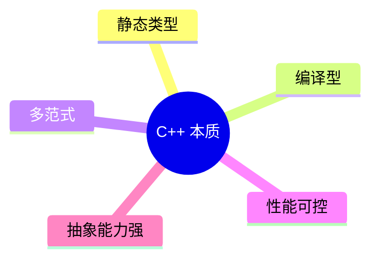

### 1.2 C++ 主要应用场景
- 高性能后端模块（低延迟、高吞吐）
- 游戏引擎与图形渲染
- 系统软件（数据库核心、编译器、中间件）
- 嵌入式与设备软件

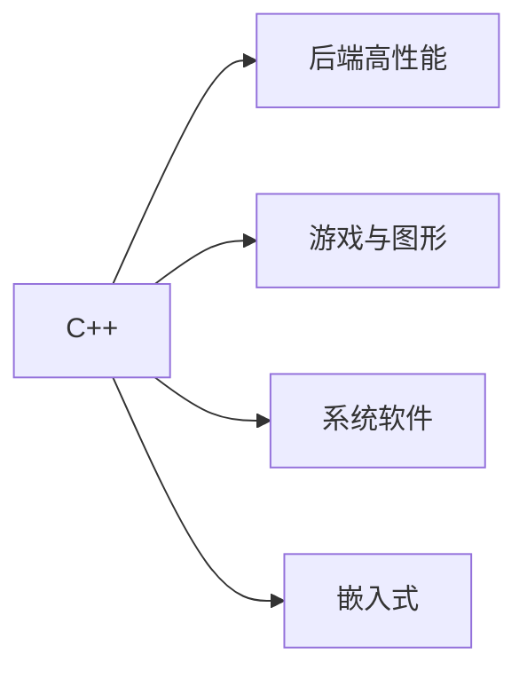

### 1.3 你真正要学的三层知识

#### 语法层
变量、函数、类、模板、STL、异常等“怎么写”。

#### 语义层
对象生命周期、所有权、拷贝与移动、RAII 等“为什么这样写”。

#### 工程层
编译链接、CMake、测试、调试、目录结构等“如何在项目里写”。

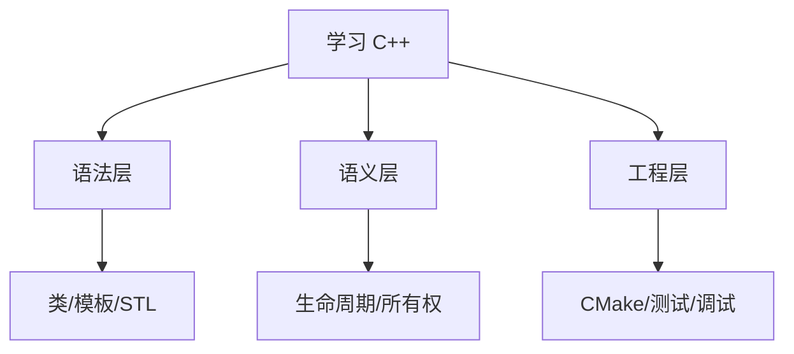

### 1.4 C++ 标准版本认知（学习基线）
现代学习建议以 **C++17/20** 为主：
- C++11：现代 C++ 起点（`auto`、Lambda、智能指针）
- C++17：工程常用增强（结构化绑定等）
- C++20：更强表达能力（`concepts`、`ranges`）

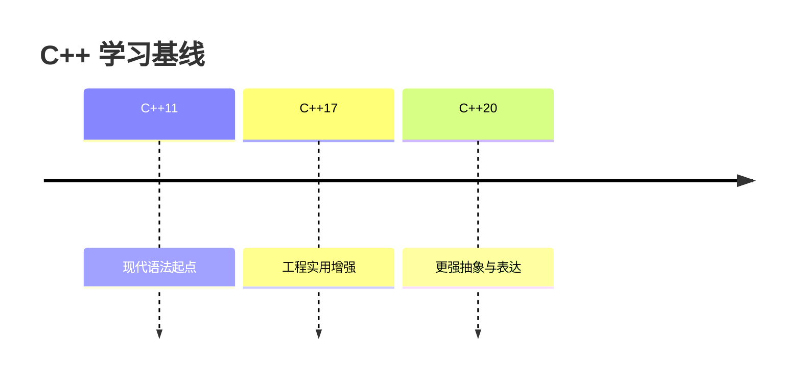

### 1.5 从源码到可执行文件：程序如何运行
典型流程：
1. 预处理（展开 `#include`、宏）
2. 编译（将 `.cpp` 转换为目标文件）
3. 链接（合并目标文件与库，生成可执行文件）

示例：
```bash
g++ -std=c++20 -Wall -Wextra main.cpp -o app
```


### 1.6 核心难点：对象生命周期与 RAII
C++ 的难点主要在“资源管理语义”。对象进入作用域时构造，离开作用域时析构。

```cpp
#include <iostream>

struct A {
    A() { std::cout << "construct\n"; }
    ~A() { std::cout << "destruct\n"; }
};

int main() {
    A a; // 进入作用域时构造
}      // 离开作用域时析构
```

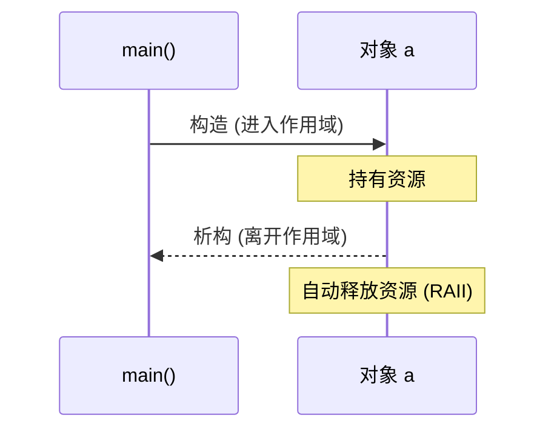

### 1.7 第一小节知识总结
- C++ 的核心价值是“性能 + 抽象 + 可控资源”。
- 学习不能只看语法，必须同时理解生命周期与工程化。
- C++17/20 是当前主学习基线。
- 编译链接流程与 RAII 是后续章节的基础。

## 2. 开发环境与工具链（知识讲解）

### 2.1 工具链由哪些部分组成
C++ 开发不是只装一个编译器，而是一套协同工具：
- 编译器：`g++` 或 `clang++`，负责把源码编译为目标文件。
- 构建系统：`CMake`，负责组织多文件工程与生成构建脚本。
- 调试器：`gdb`/`lldb`，用于断点、单步、变量检查。
- 编辑器/IDE：VS Code（配合 C/C++ 扩展）提升开发效率。

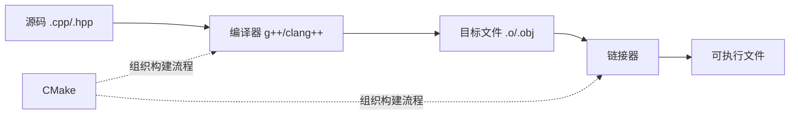

### 2.2 编译器的角色
编译器完成语法/语义检查并生成机器码。你需要理解两个常见差异：
- 标准支持差异：同一特性在不同编译器版本上的支持进度不同。
- 诊断风格差异：报错信息格式和严格程度不同。

常用编译选项：
- `-std=c++20`：指定语言标准。
- `-Wall -Wextra`：开启常用警告。
- `-Werror`：把警告当错误，提升代码质量。

### 2.3 构建系统（CMake）的作用
当项目从单文件变成多目录、多目标时，手写编译命令会变得难维护。CMake 用来声明：
- 哪些源文件参与构建
- 生成哪些目标（可执行文件/库）
- 目标间依赖关系

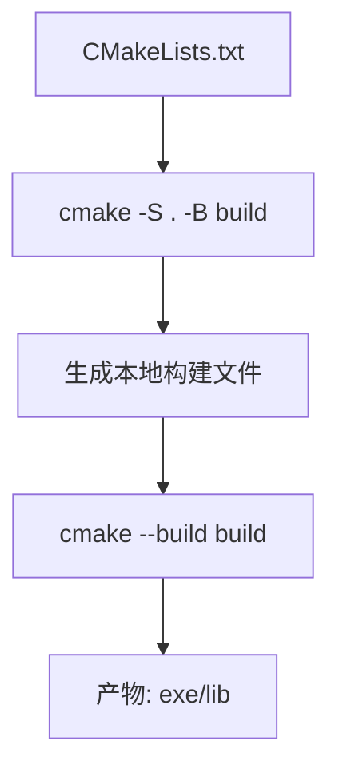

### 2.4 调试器如何帮助你定位问题
调试器的本质是“观察程序状态”：
- 断点：在特定行暂停。
- 单步：按执行路径逐行运行。
- 观察变量：查看当前作用域的数据值。
- 调用栈：定位函数调用链和崩溃位置。

没有调试器时，错误定位依赖猜测；有调试器时，定位基于证据。

### 2.5 编辑器与扩展
VS Code 在 C++ 开发里常承担“轻量 IDE”角色：
- IntelliSense：补全、跳转定义、符号搜索。
- Task/Launch：一键编译与调试。
- 与 CMake 插件协作：选择编译器、切换构建类型。

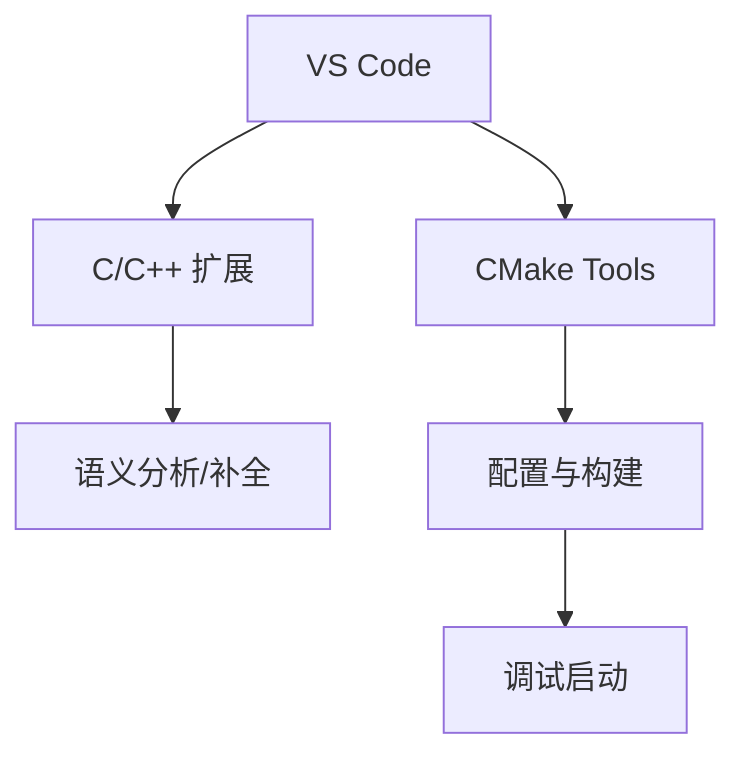

### 2.6 Debug 与 Release 的区别
- Debug：保留调试信息、优化较少，便于排错。
- Release：开启优化，运行更快，但调试信息较少。

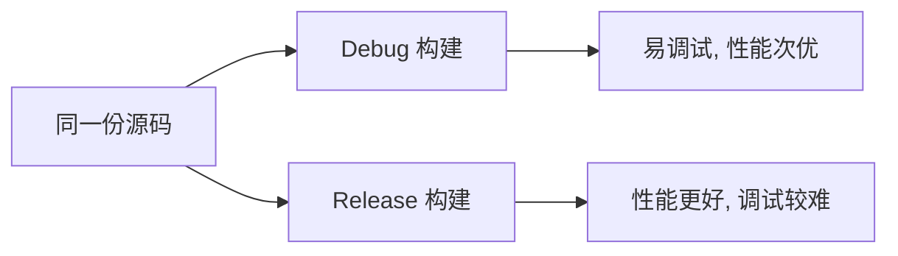

### 2.7 第 2 小节知识总结
- 工具链是“编译器 + 构建系统 + 调试器 + 编辑器”的协作体系。
- CMake 解决多文件工程可维护性问题。
- 调试器是定位问题的核心工具，不是可选项。
- Debug/Release 面向不同阶段：开发期与发布期。

## 3. 第一个 C++ 程序（知识讲解）

### 3.1 最小程序结构
一个最小 C++ 程序通常包含头文件、`main` 函数和返回值：

```cpp
#include <iostream>

int main() {
    std::cout << "Hello, C++!\n";
    return 0;
}
```

关键点：
- `#include <iostream>` 引入标准输入输出库。
- `int main()` 是程序入口。
- 返回 `0` 代表正常结束。

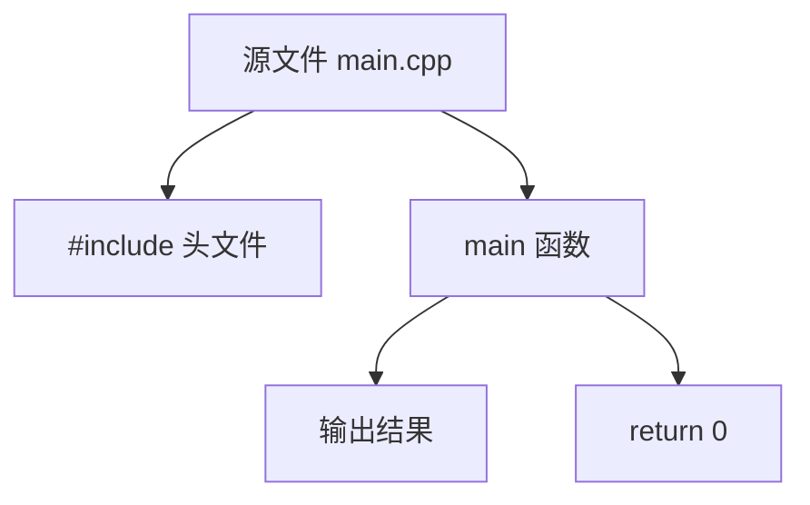

### 3.2 程序从“写完”到“可运行”发生了什么
C++ 不是直接执行源码，而是经过构建流程：
1. 预处理：展开头文件与宏。
2. 编译：将源码翻译为目标文件。
3. 链接：把目标文件和标准库合并成可执行文件。
4. 运行：操作系统加载并执行可执行文件。


### 3.3 第一条常用编译命令

```bash
g++ -std=c++20 -Wall -Wextra main.cpp -o app
```

参数含义：
- `-std=c++20`：使用 C++20 标准。
- `-Wall -Wextra`：开启常见警告。
- `-o app`：指定输出可执行文件名。

Windows PowerShell 运行：

```powershell
.\app.exe
```

### 3.4 `main` 函数与参数
`main` 常见两种形式：

```cpp
int main();
int main(int argc, char* argv[]);
```

- `argc`：命令行参数数量。
- `argv`：参数字符串数组。

这为后续命令行工具开发打基础。

### 3.5 输出与换行细节
- `"\n"`：换行字符，通常性能更好。
- `std::endl`：换行并强制刷新缓冲区。

在高频输出场景中，优先 `"\n"`，仅在确实需要立即刷新时用 `std::endl`。

### 3.6 常见错误类型（理解即可）
- 编译错误：语法错误、类型不匹配。
- 链接错误：声明了函数但没有定义实现。
- 运行错误：越界、空指针、未定义行为。

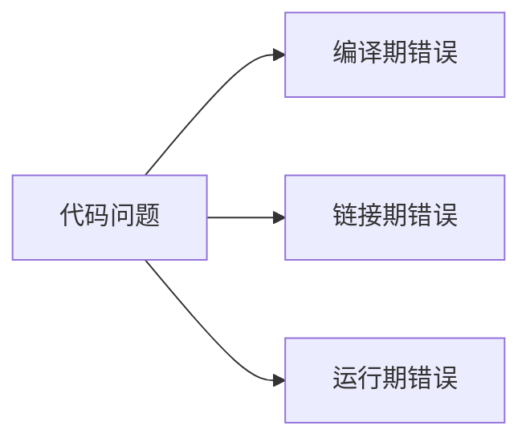

### 3.7 第 3 小节知识总结
- `main` 是程序入口，C++ 程序必须经过编译和链接。
- 单文件程序可以用一条编译命令快速构建。
- 区分编译错误、链接错误、运行错误是后续排错基础。
- 理解参数版 `main` 有助于后续命令行项目开发。

## 4. 变量、常量与基本类型（知识讲解）

### 4.1 变量与常量的本质
- 变量：可变的数据存储单元。
- 常量：初始化后不可修改的数据。

```cpp
int age = 20;           // 变量
const int maxUsers = 8; // 常量
```

C++ 中“命名 + 类型 + 生命周期”共同决定一个对象如何被使用。

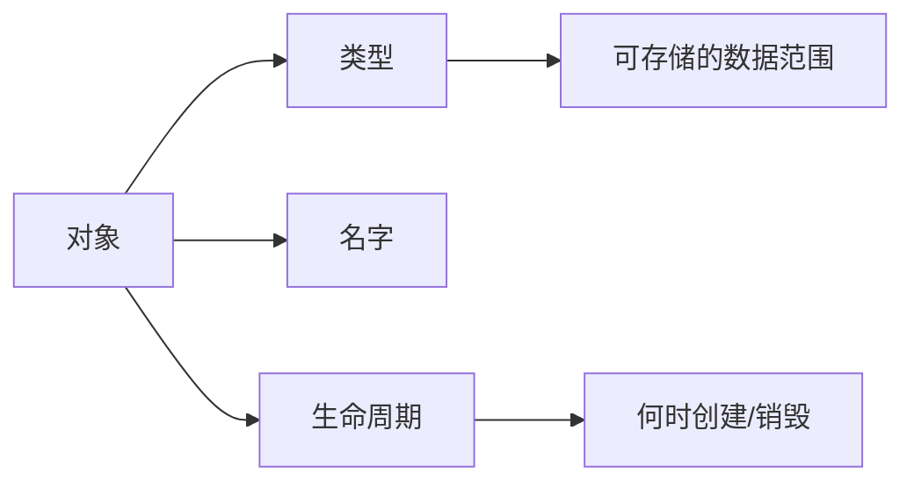

### 4.2 基本类型体系
常见基本类型：
- 整数：`short`、`int`、`long long`
- 无符号整数：`unsigned int` 等
- 浮点：`float`、`double`
- 字符：`char`
- 布尔：`bool`

注意：不同平台位宽可能不同，工程中常用 `<cstdint>` 的定宽类型（如 `int32_t`、`uint64_t`）。

### 4.3 有符号与无符号
- 有符号类型可表示负数。
- 无符号类型只能表示非负值，范围更大。

混用时要警惕隐式转换：

```cpp
int a = -1;
unsigned int b = 1;
// 比较时可能发生类型提升，结果未必符合直觉
```

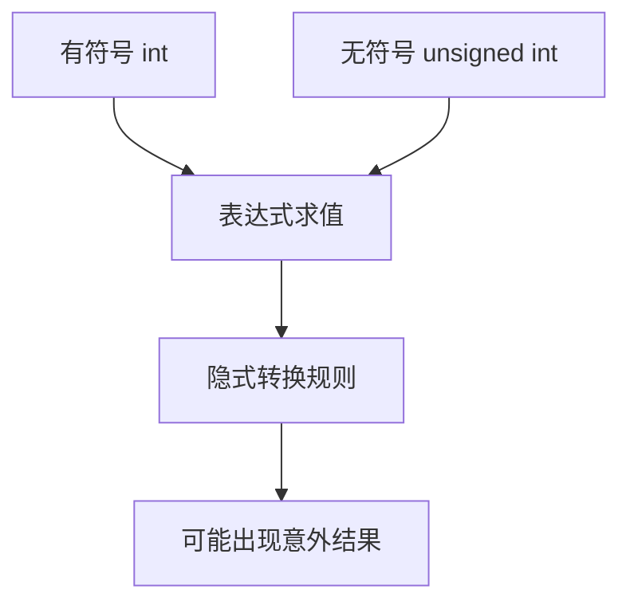

### 4.4 初始化方式
C++ 常见初始化：
- 拷贝初始化：`int x = 1;`
- 直接初始化：`int x(1);`
- 列表初始化：`int x{1};`（推荐，能避免部分窄化转换）

```cpp
int x{3};      // 推荐
// int y{3.14}; // 窄化，编译期报错
```

### 4.5 `auto` 与类型推导
`auto` 让编译器推导类型，减少冗长声明，但要确保可读性。

```cpp
auto count = 10;      // int
auto price = 9.99;    // double
auto ok = true;       // bool
```

原则：当右值类型明确时优先 `auto`，当类型语义需要强调时写显式类型。

### 4.6 作用域与生命周期
- 局部变量：在代码块内有效，离开块后销毁。
- 全局变量：程序启动到结束期间存在。
- 静态局部变量：函数内定义，但生命周期贯穿程序全程。

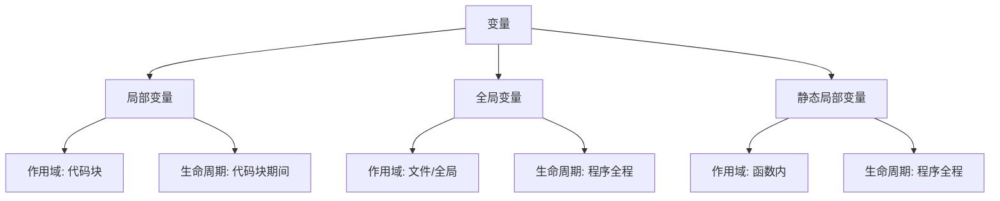

### 4.7 类型转换
- 隐式转换：编译器自动完成。
- 显式转换：程序员主动指定（优先 `static_cast`）。

```cpp
double score = 95.5;
int whole = static_cast<int>(score); // 95
```

避免 C 风格强转 `(int)score`，可读性和安全性较差。

### 4.8 第 4 小节知识总结
- 类型决定数据范围和运算语义。
- 初始化方式会影响安全性，推荐使用 `{}` 初始化。
- `auto` 提升简洁度，但要兼顾可读性。
- 作用域与生命周期是后续内存管理与对象语义的基础。
- 类型转换要显式、可控，减少隐式转换带来的错误。

## 5. 运算符与表达式（知识讲解）

### 5.1 什么是表达式
表达式是“计算并产生结果”的代码片段，运算符用于组合操作数形成表达式。

```cpp
int a = 3;
int b = 5;
int c = a + b * 2; // 一个表达式
```


### 5.2 运算符分类
- 算术运算符：`+ - * / %`
- 关系运算符：`== != < <= > >=`
- 逻辑运算符：`&& || !`
- 赋值运算符：`= += -= *= /= %=`
- 自增自减：`++ --`
- 条件运算符：`?:`
- 位运算符：`& | ^ ~ << >>`

### 5.3 优先级与结合性
同一表达式里，运算符按优先级计算；同级运算符按结合性决定方向。

```cpp
int x = 2 + 3 * 4;   // 14，先乘后加
int y = (2 + 3) * 4; // 20，用括号改变顺序
```

原则：不要依赖“记忆极限”，复杂表达式优先加括号增强可读性。

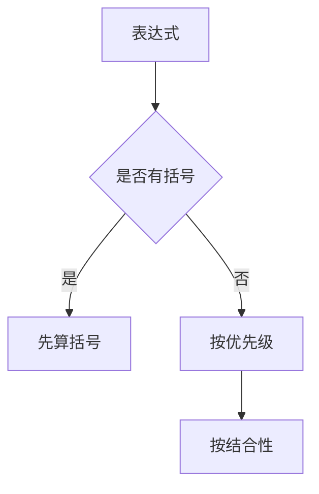

### 5.4 前置与后置自增
- `++i`：先加 1，再返回新值。
- `i++`：先返回旧值，再加 1。

```cpp
int i = 1;
int a = ++i; // i=2, a=2
int b = i++; // b=2, i=3
```

在不需要旧值时，优先前置形式，语义更直接。

### 5.5 短路求值（逻辑运算关键）
- `A && B`：若 `A` 为假，`B` 不再计算。
- `A || B`：若 `A` 为真，`B` 不再计算。

```cpp
int* p = nullptr;
if (p != nullptr && *p > 0) {
    // 安全：当 p 为 nullptr 时不会解引用
}
```

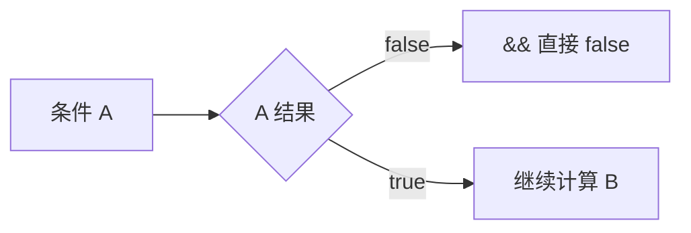

### 5.6 隐式类型提升
混合类型运算会发生“整型提升/通常算术转换”。

```cpp
int a = 5;
double b = 2.0;
a + b; // 结果类型为 double
```

风险点：有符号与无符号混算、整除截断。

```cpp
int m = 5 / 2;      // 2（整数除法）
double n = 5 / 2.0; // 2.5
```

### 5.7 位运算基础认知
位运算直接操作二进制位，常用于权限位、状态位、性能敏感场景。

```cpp
unsigned int flag = 0b0101;
flag |= 0b0010; // 置位 -> 0111
flag &= ~0b0001; // 清位 -> 0110
```

### 5.8 常见错误模式
- 把 `=` 写成 `==`（或反过来）。
- 整数除法误当浮点除法。
- 复杂表达式无括号导致误读。
- 忽视短路求值和副作用顺序。

### 5.9 第 5 小节知识总结
- 表达式是值计算的核心，运算符决定计算规则。
- 优先级和结合性影响结果，括号是可读性与安全性的工具。
- 短路求值可避免无效或危险计算。
- 类型提升和整数除法是初学阶段高频错误点。

## 6. 输入输出与文件基础（知识讲解）

### 6.1 标准输入输出流
C++ 使用流（stream）模型进行 I/O：
- `std::cin`：标准输入（键盘）
- `std::cout`：标准输出（控制台）
- `std::cerr`：标准错误输出（通常不缓冲）

```cpp
#include <iostream>

int main() {
    int x{};
    std::cout << "请输入整数: ";
    std::cin >> x;
    std::cout << "你输入的是 " << x << "\n";
}
```


### 6.2 提取运算符与插入运算符
- `>>`：从流中提取数据到变量。
- `<<`：把数据插入到输出流。

注意：`cin >> str` 默认以空白字符分隔，读取一行文本应使用 `std::getline`。

### 6.3 `std::getline` 与缓冲区问题
`std::getline` 读取整行（可包含空格）：

```cpp
#include <iostream>
#include <string>

int main() {
    int age{};
    std::string name;

    std::cin >> age;
    std::cin.ignore();        // 忽略残留换行
    std::getline(std::cin, name);
}
```

当 `>>` 后紧接 `getline`，常见问题是前者留下的换行符被后者直接读取。

### 6.4 流状态与错误处理
输入失败时，流会进入失败状态，后续读取会持续失败，直到清除状态。

```cpp
if (!(std::cin >> value)) {
    std::cin.clear();
    std::cin.ignore(1024, '\n');
}
```

```mermaid
flowchart TD
  A[尝试读取] --> B{读取成功?}
  B -- 是 --> C[继续处理]
  B -- 否 --> D[fail 状态]
  D --> E[clear()]
  E --> F[ignore()]
  F --> A
```

### 6.5 输出格式化基础
常见格式化工具来自 `<iomanip>`：
- `std::fixed`：定点表示
- `std::setprecision(n)`：小数位控制
- `std::setw(n)`：字段宽度

```cpp
#include <iomanip>
std::cout << std::fixed << std::setprecision(2) << 3.14159 << "\n"; // 3.14
```

### 6.6 文件输入输出
文件流类型：
- `std::ifstream`：读文件
- `std::ofstream`：写文件
- `std::fstream`：读写文件

```cpp
#include <fstream>
#include <string>

std::ofstream out("data.txt");
out << "hello\n";
out.close();

std::ifstream in("data.txt");
std::string line;
while (std::getline(in, line)) {
    // 处理 line
}
```

```mermaid
flowchart LR
  A[程序] --> B[open 文件]
  B --> C{打开成功?}
  C -- 否 --> D[错误处理]
  C -- 是 --> E[读/写循环]
  E --> F[close]
```

### 6.7 文本模式与二进制模式
默认是文本模式。处理图片、音频等原始字节数据时应使用二进制模式：

```cpp
std::ifstream in("a.bin", std::ios::binary);
```

### 6.8 常见错误模式
- 未检查文件是否打开成功。
- 混用 `>>` 与 `getline` 忽略缓冲区换行。
- 输入失败后未 `clear + ignore`。
- 直接信任用户输入，缺少边界校验。

### 6.9 第 6 小节知识总结
- C++ I/O 基于流对象，核心是流状态管理。
- `>>` 与 `getline` 适用于不同读取场景。
- 文件读写必须做“打开检查 + 错误处理”。
- 正确处理输入失败和缓冲区问题是写稳健程序的基础。

## 7. 分支与循环控制（知识讲解）

### 7.1 控制流的意义
控制流用于决定“哪些语句执行、执行几次、何时结束”。
核心结构分为两类：
- 分支：根据条件选择路径。
- 循环：重复执行一段逻辑直到条件变化。

```mermaid
graph TD
  A[程序执行] --> B[分支]
  A --> C[循环]
  B --> D[if / switch]
  C --> E[for / while / do-while]
```

### 7.2 `if / else if / else`
`if` 适合处理范围判断、布尔条件组合。

```cpp
int score = 82;
if (score >= 90) {
    std::cout << "A\n";
} else if (score >= 80) {
    std::cout << "B\n";
} else {
    std::cout << "C\n";
}
```

条件表达式最终会转换为布尔值，建议写出显式比较，减少歧义。

### 7.3 `switch` 结构
`switch` 适合离散值分派（如状态码、菜单命令）。

```cpp
int cmd = 2;
switch (cmd) {
case 1:
    std::cout << "start\n";
    break;
case 2:
    std::cout << "stop\n";
    break;
default:
    std::cout << "unknown\n";
    break;
}
```

重点：`case` 末尾通常要 `break`，否则会发生贯穿（fallthrough）。

```mermaid
flowchart TD
  A[switch(expr)] --> B{case 1?}
  B -- 是 --> C[执行 case 1]
  B -- 否 --> D{case 2?}
  D -- 是 --> E[执行 case 2]
  D -- 否 --> F[default]
```

### 7.4 `for` 循环
`for` 适合“已知迭代次数”或“按索引访问”。

```cpp
for (int i = 0; i < 5; ++i) {
    std::cout << i << " ";
}
```

结构：初始化 -> 条件判断 -> 执行体 -> 迭代表达式。

### 7.5 `while` 与 `do-while`
- `while`：先判断再执行，可能一次都不执行。
- `do-while`：先执行再判断，至少执行一次。

```cpp
int n = 0;
while (n < 3) {
    ++n;
}

do {
    --n;
} while (n > 0);
```

### 7.6 循环控制语句
- `break`：立即退出当前循环。
- `continue`：跳过本次剩余语句，进入下一次迭代。

```cpp
for (int i = 0; i < 10; ++i) {
    if (i == 5) break;
    if (i % 2 == 0) continue;
    std::cout << i << " "; // 输出 1 3
}
```

```mermaid
flowchart LR
  A[进入循环体] --> B{条件1 break?}
  B -- 是 --> C[退出循环]
  B -- 否 --> D{条件2 continue?}
  D -- 是 --> E[下一次迭代]
  D -- 否 --> F[执行剩余逻辑]
```

### 7.7 常见错误模式
- `if (x = 3)` 写成赋值而非比较（应为 `==`）。
- `switch` 忘记 `break` 导致意外贯穿。
- 循环条件不更新造成死循环。
- 边界条件错误导致越界（如 `i <= size`）。

### 7.8 可读性与工程建议
- 分支条件复杂时拆成布尔变量，提升可读性。
- 避免超过 3 层嵌套；必要时提取函数。
- 循环优先前置自增 `++i`（语义更统一）。
- 明确处理边界值：空输入、0 次循环、单元素场景。

### 7.9 第 7 小节知识总结
- 分支决定“走哪条路”，循环决定“走几次”。
- `if` 适合范围判断，`switch` 适合离散分派。
- `break/continue` 是控制循环行为的核心工具。
- 控制流错误多来自边界和条件写法，需重点检查。

## 8. 函数基础（知识讲解）

### 8.1 为什么需要函数
函数用于把重复逻辑封装为可复用单元，提升可读性、可测试性与维护性。

```mermaid
graph TD
  A[需求逻辑] --> B[拆分为函数]
  B --> C[复用]
  B --> D[易测试]
  B --> E[易维护]
```

### 8.2 函数声明与定义
- 声明（declaration）：告诉编译器“函数存在”。
- 定义（definition）：提供函数具体实现。

```cpp
#include <iostream>

int add(int a, int b); // 声明

int main() {
    std::cout << add(2, 3) << "\n";
}

int add(int a, int b) { // 定义
    return a + b;
}
```

多文件工程中，声明通常放头文件，定义放 `.cpp`。

### 8.3 参数与返回值
函数通过参数接收输入，通过 `return` 返回结果。

```cpp
double area(double r) {
    return 3.14159 * r * r;
}
```

设计原则：参数表达输入边界，返回值表达核心结果。

### 8.4 值传递与引用传递
- 值传递：传入副本，函数内修改不影响外部。
- 引用传递：传入别名，函数内修改会影响外部对象。

```cpp
void incByValue(int x) { ++x; }
void incByRef(int& x) { ++x; }
```

```mermaid
flowchart LR
  A[实参 x] --> B{传参方式}
  B -- 值传递 --> C[拷贝副本]
  C --> D[外部 x 不变]
  B -- 引用传递 --> E[同一对象别名]
  E --> F[外部 x 改变]
```

### 8.5 `const` 参数
只读参数应使用 `const`，明确语义并防止误修改。

```cpp
int length(const std::string& s) {
    return static_cast<int>(s.size());
}
```

对大对象，常见写法是 `const T&`，避免拷贝开销。

### 8.6 默认参数
默认参数在调用时可省略部分实参。

```cpp
void log(const std::string& msg, int level = 1);
```

规则：默认值从右向左连续提供，声明与定义中只保留一处默认值（通常在声明处）。

### 8.7 函数重载
同名函数可通过不同参数列表区分。

```cpp
int absValue(int x) { return x < 0 ? -x : x; }
double absValue(double x) { return x < 0 ? -x : x; }
```

重载解析在编译期完成，返回类型不同但参数相同不构成有效重载。

### 8.8 内联函数与头文件实现
`inline` 建议编译器内联展开，减少调用开销（是否展开由编译器决定）。

```cpp
inline int square(int x) { return x * x; }
```

小而频繁调用的函数可考虑内联，大函数不建议强行内联。

### 8.9 递归基础
函数可以调用自身，需具备“终止条件 + 递归推进”。

```cpp
int fact(int n) {
    if (n <= 1) return 1;
    return n * fact(n - 1);
}
```

递归表达清晰，但要关注栈深度与性能。

### 8.10 常见错误模式
- 只声明不定义，导致链接错误。
- 头文件重复定义普通函数，导致重定义错误。
- 不必要的大对象值传递造成性能浪费。
- 递归缺失终止条件导致栈溢出。

### 8.11 第 8 小节知识总结
- 函数是 C++ 代码组织的基础单元。
- 理解声明/定义分离是工程化前提。
- 参数传递方式决定语义与性能。
- `const`、重载、默认参数提升接口表达力。
- 递归与内联需按场景权衡可读性和效率。

## 9. 引用与 `const` 语义（知识讲解）

### 9.1 引用的本质
引用（`T&`）是已存在对象的别名，不是独立对象。

```cpp
int x = 10;
int& ref = x; // ref 是 x 的别名
ref = 20;     // x 也变成 20
```

关键性质：
- 引用必须初始化。
- 普通引用不能绑定到字面量等右值。
- 引用一旦绑定，不可改绑到别的对象。

```mermaid
graph LR
  A[x: int] <--别名--> B[ref: int&]
  B --> C[写入 ref]
  C --> D[x 同步变化]
```

### 9.2 为什么引用重要
引用是函数参数设计核心：
- 通过引用避免大对象拷贝。
- 通过引用实现“在函数内修改外部对象”。
- 与 `const` 结合表达只读语义。

### 9.3 `const` 的核心语义
`const` 表示“只读约束”。它约束的是“通过该名字是否可修改对象”。

```cpp
const int a = 5;
// a = 6; // 错误：只读
```

重要理解：`const` 是接口承诺，告诉调用方“此处不会改动你的数据”。

### 9.4 `const` 引用
`const T&` 是高频接口形式：
- 避免拷贝
- 保证只读
- 可绑定左值和右值（包括临时对象）

```cpp
void printValue(const std::string& s) {
    std::cout << s << "\n";
}

printValue("hello"); // 字面量构造临时 string 后可绑定 const 引用
```

```mermaid
flowchart TD
  A[实参] --> B{参数类型}
  B -- T& --> C[可改, 仅左值]
  B -- const T& --> D[只读, 左值/右值均可]
```

### 9.5 顶层 const 与底层 const
- 顶层 const：对象本身不可改（如 `const int x`）。
- 底层 const：通过某个间接访问路径不可改（如 `const int* p`）。

这一区分在模板推导、`auto` 推导、指针声明中非常关键。

### 9.6 `const` 与指针组合（重点）

```cpp
int v = 10;
const int* p1 = &v; // 指向常量的指针：*p1 不可改，p1 可改指向
int* const p2 = &v; // 常量指针：p2 不可改指向，*p2 可改
const int* const p3 = &v; // 两者都不可改
```

```mermaid
graph TD
  A[const int* p1] --> A1[改指向: 可以]
  A --> A2[改值: 不可以]
  B[int* const p2] --> B1[改指向: 不可以]
  B --> B2[改值: 可以]
  C[const int* const p3] --> C1[改指向: 不可以]
  C --> C2[改值: 不可以]
```

### 9.7 `auto` 推导与 const 丢失问题
`auto` 默认会忽略顶层 `const`：

```cpp
const int x = 42;
auto a = x;       // a 是 int（顶层 const 被丢弃）
const auto b = x; // b 是 const int
```

若需要保持引用与只读属性，应写：

```cpp
const int& r = x;
auto c = r;        // c 是 int
const auto& d = r; // d 是 const int&
```

### 9.8 常见错误模式
- 把“只读参数”写成值传递，导致多余拷贝。
- 误把 `const int*` 理解为“指针常量”。
- 使用 `auto` 时丢失 `const`/引用语义。
- 为追求“能改”滥用 `const_cast`（高风险）。

### 9.9 第 9 小节知识总结
- 引用是别名机制，是函数接口设计核心。
- `const` 是只读承诺与设计约束，不是装饰语法。
- `const T&` 是高频且高性价比的参数形式。
- 指针与 `const` 组合必须精确理解“谁可改、谁不可改”。
- 掌握 `auto` 对 `const` 的推导规则，能避免大量隐性 bug。

## 10. 指针基础
掌握地址、解引用、空指针与常见错误。

## 11. 数组与字符串
掌握 C 风格数组与 `std::string`。

## 12. 结构体与枚举
使用 `struct`、`enum class` 组织数据。

## 13. 类与对象入门
封装、访问控制、构造与析构。

## 14. 拷贝控制与对象语义
拷贝构造、赋值运算符、析构职责。

## 15. 继承与多态
虚函数、覆盖、抽象类与接口设计。

## 16. 运算符重载
理解可读性与语义一致性的重载规则。

## 17. 模板基础
函数模板、类模板与泛型思维。

## 18. STL 容器（一）
`vector`、`deque`、`list` 的使用场景。

## 19. STL 容器（二）
`map`、`set`、`unordered_map` 的选择。

## 20. 迭代器与算法库
使用 `sort`、`find`、`accumulate` 等算法。

## 21. Lambda 与函数对象
掌握闭包、捕获方式与可调用对象。

## 22. 异常处理与错误模型
`try/catch`、异常安全与错误边界设计。

## 23. 内存管理与 RAII
理解栈堆、资源释放与生命周期管理。

## 24. 智能指针
`unique_ptr`、`shared_ptr`、`weak_ptr`。

## 25. 移动语义与完美转发
右值引用、`std::move`、`std::forward`。

## 26. 并发编程基础
线程、互斥锁、条件变量与原子操作。

## 27. 现代 C++ 特性补充
`constexpr`、结构化绑定、`optional`、`variant`。

## 28. CMake 工程化实践
多目录工程、目标链接、Debug/Release 配置。

## 29. 测试与调试
GoogleTest 入门、断点调试、日志排查。

## 30. 综合项目与复盘提升
完成完整项目并进行性能、结构与代码复盘。

---

## 学习节奏建议
- 每周完成 1-2 小节，并配套代码练习。
- 每 5 小节做一次小整合项目。
- 每月进行一次阶段复盘，记录薄弱点。

## 编码规范建议
- 编译参数：`-std=c++20 -Wall -Wextra -Werror`
- 命名：类型 `PascalCase`，函数/变量 `camelCase`，常量 `kCamelCase`
- 代码组织：单一职责、低耦合、高可读性。


