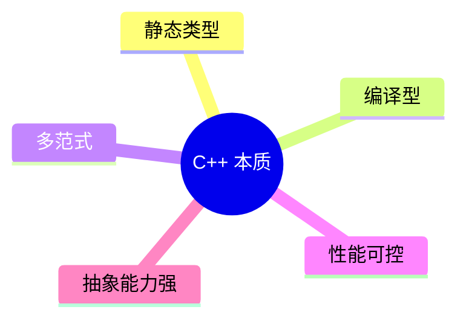
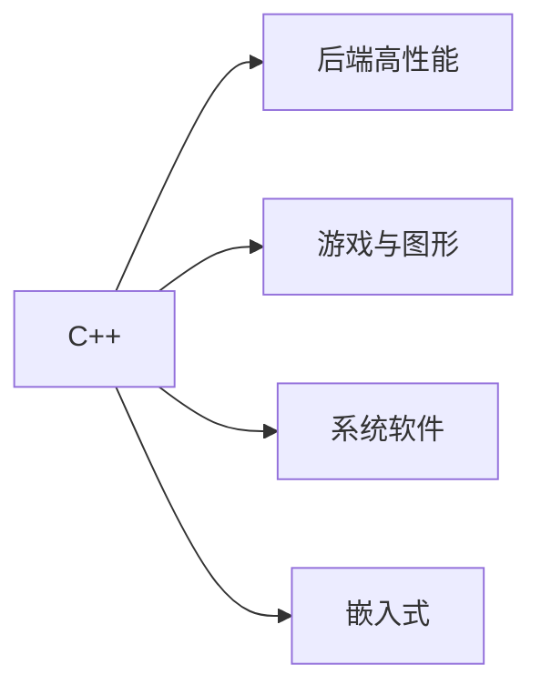
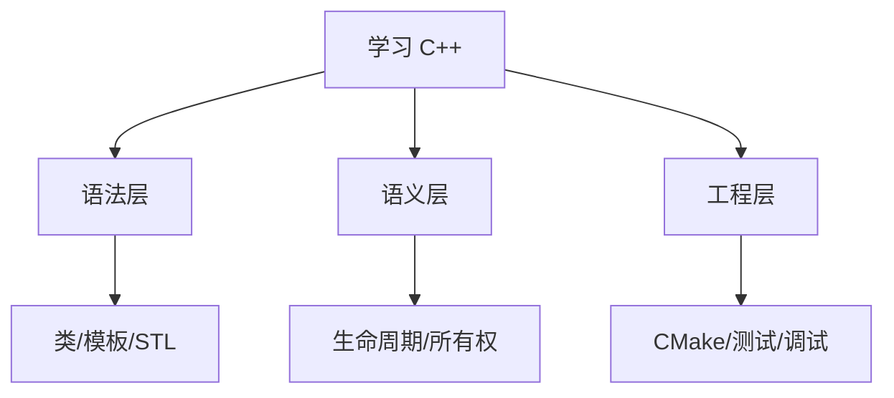
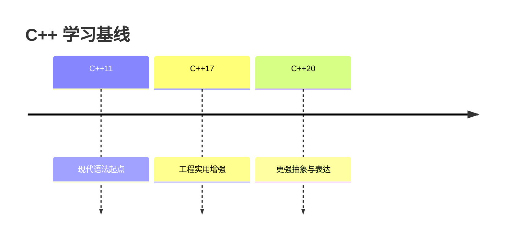
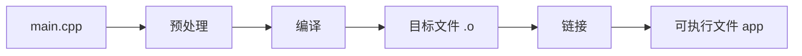
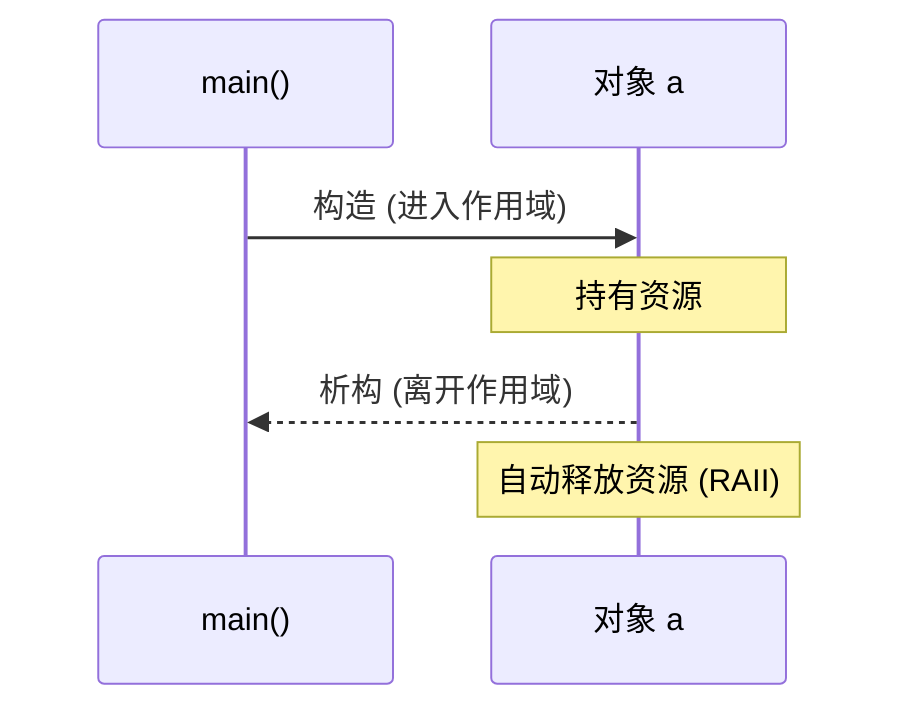
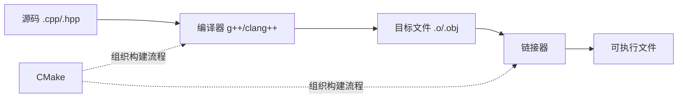
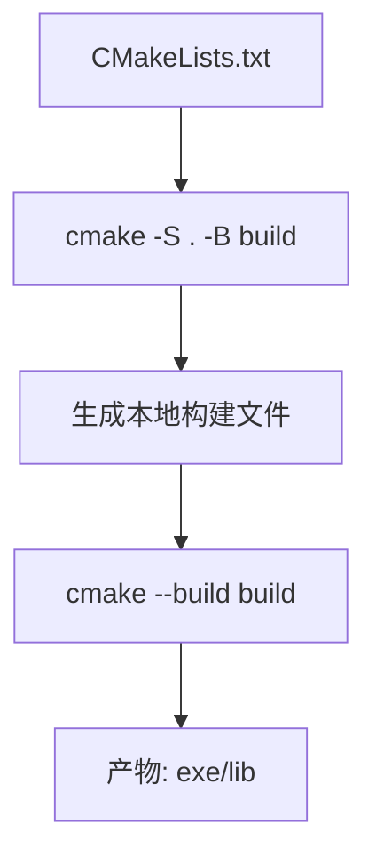
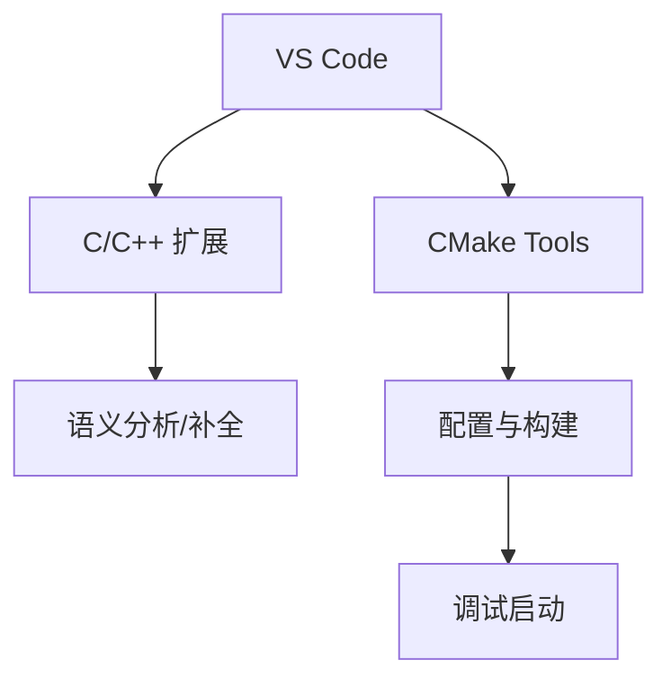
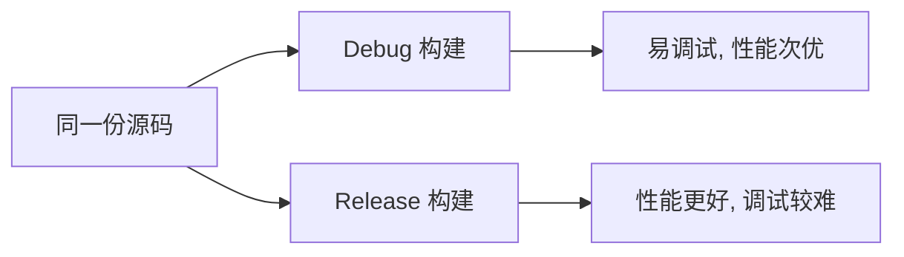

# C++ 学习大纲（30 小节）

## 1. 学习目标与路线图（知识讲解）

### 1.1 C++ 的本质
C++ 是一门**静态类型**、**编译型**、**多范式**语言。它既能贴近硬件写高性能代码，也能通过类和模板构建高层抽象。

- 静态类型：类型在编译期确定，很多错误可提前发现。
- 编译型：先生成机器码再运行，通常性能更高。
- 多范式：过程式、面向对象、泛型可以组合使用。



### 1.2 C++ 主要应用场景
- 高性能后端模块（低延迟、高吞吐）
- 游戏引擎与图形渲染
- 系统软件（数据库核心、编译器、中间件）
- 嵌入式与设备软件



### 1.3 你真正要学的三层知识

#### 语法层
变量、函数、类、模板、STL、异常等“怎么写”。

#### 语义层
对象生命周期、所有权、拷贝与移动、RAII 等“为什么这样写”。

#### 工程层
编译链接、CMake、测试、调试、目录结构等“如何在项目里写”。



### 1.4 C++ 标准版本认知（学习基线）
现代学习建议以 **C++17/20** 为主：
- C++11：现代 C++ 起点（`auto`、Lambda、智能指针）
- C++17：工程常用增强（结构化绑定等）
- C++20：更强表达能力（`concepts`、`ranges`）



### 1.5 从源码到可执行文件：程序如何运行
典型流程：
1. 预处理（展开 `#include`、宏）
2. 编译（将 `.cpp` 转换为目标文件）
3. 链接（合并目标文件与库，生成可执行文件）

示例：
```bash
g++ -std=c++20 -Wall -Wextra main.cpp -o app
```



### 1.6 核心难点：对象生命周期与 RAII
C++ 的难点主要在“资源管理语义”。对象进入作用域时构造，离开作用域时析构。

```cpp
#include <iostream>

struct A {
    A() { std::cout << "construct\n"; }
    ~A() { std::cout << "destruct\n"; }
};

int main() {
    A a; // 进入作用域时构造
}      // 离开作用域时析构
```



### 1.7 第一小节知识总结
- C++ 的核心价值是“性能 + 抽象 + 可控资源”。
- 学习不能只看语法，必须同时理解生命周期与工程化。
- C++17/20 是当前主学习基线。
- 编译链接流程与 RAII 是后续章节的基础。

## 2. 开发环境与工具链（知识讲解）

### 2.1 工具链由哪些部分组成
C++ 开发不是只装一个编译器，而是一套协同工具：
- 编译器：`g++` 或 `clang++`，负责把源码编译为目标文件。
- 构建系统：`CMake`，负责组织多文件工程与生成构建脚本。
- 调试器：`gdb`/`lldb`，用于断点、单步、变量检查。
- 编辑器/IDE：VS Code（配合 C/C++ 扩展）提升开发效率。



### 2.2 编译器的角色
编译器完成语法/语义检查并生成机器码。你需要理解两个常见差异：
- 标准支持差异：同一特性在不同编译器版本上的支持进度不同。
- 诊断风格差异：报错信息格式和严格程度不同。

常用编译选项：
- `-std=c++20`：指定语言标准。
- `-Wall -Wextra`：开启常用警告。
- `-Werror`：把警告当错误，提升代码质量。

### 2.3 构建系统（CMake）的作用
当项目从单文件变成多目录、多目标时，手写编译命令会变得难维护。CMake 用来声明：
- 哪些源文件参与构建
- 生成哪些目标（可执行文件/库）
- 目标间依赖关系



### 2.4 调试器如何帮助你定位问题
调试器的本质是“观察程序状态”：
- 断点：在特定行暂停。
- 单步：按执行路径逐行运行。
- 观察变量：查看当前作用域的数据值。
- 调用栈：定位函数调用链和崩溃位置。

没有调试器时，错误定位依赖猜测；有调试器时，定位基于证据。

### 2.5 编辑器与扩展
VS Code 在 C++ 开发里常承担“轻量 IDE”角色：
- IntelliSense：补全、跳转定义、符号搜索。
- Task/Launch：一键编译与调试。
- 与 CMake 插件协作：选择编译器、切换构建类型。



### 2.6 Debug 与 Release 的区别
- Debug：保留调试信息、优化较少，便于排错。
- Release：开启优化，运行更快，但调试信息较少。



### 2.7 第 2 小节知识总结
- 工具链是“编译器 + 构建系统 + 调试器 + 编辑器”的协作体系。
- CMake 解决多文件工程可维护性问题。
- 调试器是定位问题的核心工具，不是可选项。
- Debug/Release 面向不同阶段：开发期与发布期。

## 3. 第一个 C++ 程序
编写 Hello World，理解源码到可执行文件流程。

## 4. 变量、常量与基本类型
掌握整型、浮点、字符、布尔与类型转换。

## 5. 运算符与表达式
理解算术、关系、逻辑、位运算及优先级。

## 6. 输入输出与文件基础
使用 `iostream`、文件流进行读写。

## 7. 分支与循环控制
熟练使用 `if`、`switch`、`for`、`while`。

## 8. 函数基础
函数声明定义、参数、返回值、作用域。

## 9. 引用与 `const` 语义
理解引用传递、常量正确性与接口设计。

## 10. 指针基础
掌握地址、解引用、空指针与常见错误。

## 11. 数组与字符串
掌握 C 风格数组与 `std::string`。

## 12. 结构体与枚举
使用 `struct`、`enum class` 组织数据。

## 13. 类与对象入门
封装、访问控制、构造与析构。

## 14. 拷贝控制与对象语义
拷贝构造、赋值运算符、析构职责。

## 15. 继承与多态
虚函数、覆盖、抽象类与接口设计。

## 16. 运算符重载
理解可读性与语义一致性的重载规则。

## 17. 模板基础
函数模板、类模板与泛型思维。

## 18. STL 容器（一）
`vector`、`deque`、`list` 的使用场景。

## 19. STL 容器（二）
`map`、`set`、`unordered_map` 的选择。

## 20. 迭代器与算法库
使用 `sort`、`find`、`accumulate` 等算法。

## 21. Lambda 与函数对象
掌握闭包、捕获方式与可调用对象。

## 22. 异常处理与错误模型
`try/catch`、异常安全与错误边界设计。

## 23. 内存管理与 RAII
理解栈堆、资源释放与生命周期管理。

## 24. 智能指针
`unique_ptr`、`shared_ptr`、`weak_ptr`。

## 25. 移动语义与完美转发
右值引用、`std::move`、`std::forward`。

## 26. 并发编程基础
线程、互斥锁、条件变量与原子操作。

## 27. 现代 C++ 特性补充
`constexpr`、结构化绑定、`optional`、`variant`。

## 28. CMake 工程化实践
多目录工程、目标链接、Debug/Release 配置。

## 29. 测试与调试
GoogleTest 入门、断点调试、日志排查。

## 30. 综合项目与复盘提升
完成完整项目并进行性能、结构与代码复盘。

---

## 学习节奏建议
- 每周完成 1-2 小节，并配套代码练习。
- 每 5 小节做一次小整合项目。
- 每月进行一次阶段复盘，记录薄弱点。

## 编码规范建议
- 编译参数：`-std=c++20 -Wall -Wextra -Werror`
- 命名：类型 `PascalCase`，函数/变量 `camelCase`，常量 `kCamelCase`
- 代码组织：单一职责、低耦合、高可读性。

